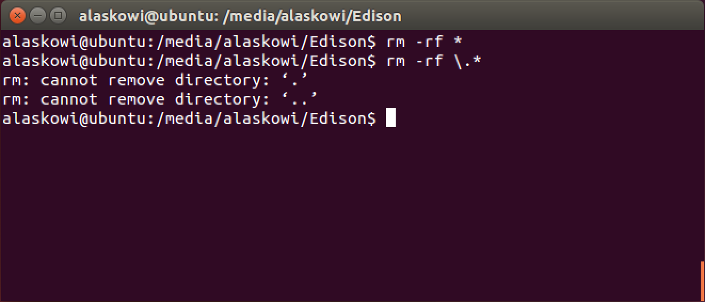

## Step 1: Prepare built-in flash storage (Linux)

Make sure there are no files on the built-in flash storage of the Intel® Edison by formatting the storage. The storage **must** be formatted as FAT32.

---

1. In order to read or write to the Intel® Edison's built-in flash storage, connect the Intel® Edison to your computer via the **device mode** micro-USB connector.

  

2. Open up a new Terminal window.

3. Use the "cd" command to go into the "Edison" drive. 

  **Replace "[username]" with your actual username.**
  
  **note - use "/media/[username]/Edison" _not_ "/media/psf/Edison".**

  ```
  cd /media/[username]/Edison
  ```

4. Use the "rm" command to remove **all** visible and invisible files. 

  **Double-check and make sure you are in the Intel® Edison's drive!**

  ```
  rm –rf *
  rm –rf \.*
  ```

  

---

All files should now be removed. To confirm, use the "ls" command to list the files.

```
ls
```
