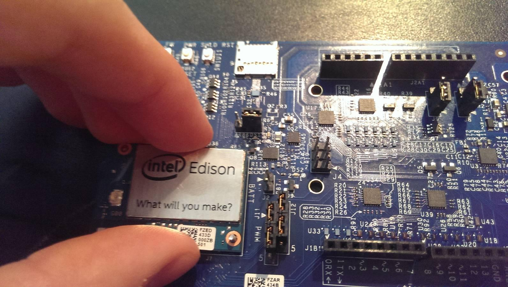
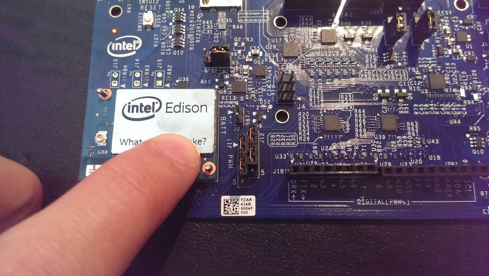
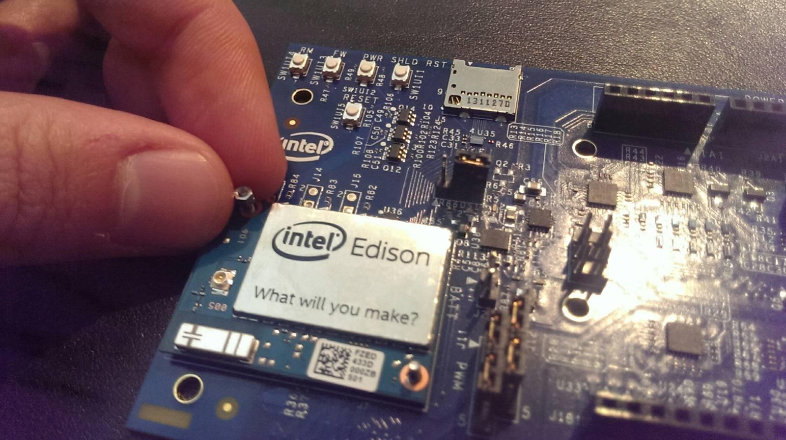
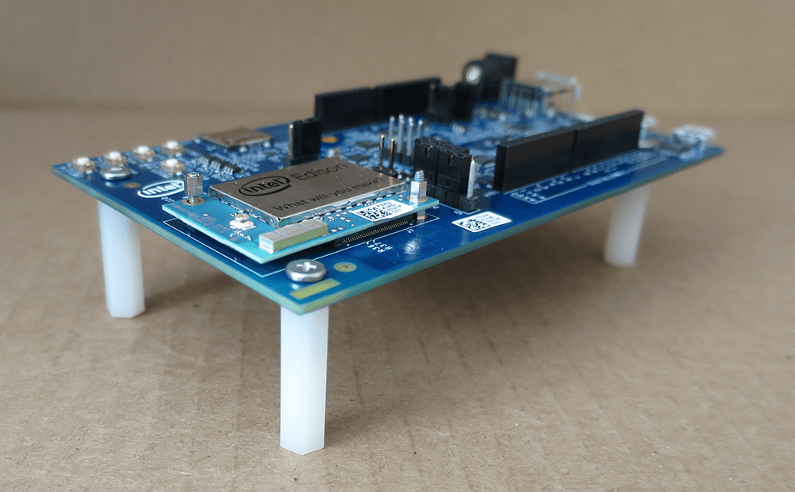

# Materials List and Assembly

Find out what is in your Intel® Edison Kit for Arduino box. Some assembly is required. ;)

**Videos related to this document**

* [Intel Edison Kit for Arduino: Unboxing and Assembly]()

**Table of contents**

* [Look in the Intel® Edison Kit for Arduino box]()
* [Quick Start Assembly Instructions]()
* [Install the Intel® Edison module]()
* [Install the plastic spacers]()
* [Example of a full development setup]()

**Do you have two micro-USB cables?**

To initially set up the Intel® Edison, you will need 2 micro-USB cables. 
If you received a Grove Starter Kit, only one micro-USB cable is supplied in the Grove Starter Kit box.

## Look in the Intel® Edison Kit for Arduino box

* Intel® Edison module. Refer to product brief for specs. 
* Intel® Edison kit for Arduino expansion board. Software and hardware pin-compatible with Arduino Uno R3 shields. 
* Small hex nuts (x2) - For attaching Intel® Edison module to expansion board.
* Screws (x4) & plastic spacers (x4) - To keep the expansion board stable and lifted off surfaces.

## Quick Start Assembly Instructions

### Install the Intel® Edison module

The Intel® Edison module is meant to be used with breakout boards or custom PCBs. You will need to secure your Intel® Edison module to the Arduino expansion board before you can use it.

1. Place the Intel® Edison module within the white outline on the Arduino expansion board, lining up the holes on the Intel® Edison module with the screws on the expansion board.

	

2. Press down on the Intel® Edison module just below the words "What will you make?" until you feel a snap.

	

3. Use the two hex nuts to secure the module to the expansion board. Hand tighten (but not too tight) the hex nuts onto the two screws that protrude through the board.

	

### Install the plastic spacers

To add stability to the expansion board and to help avoid accidental short circuits, attach the four plastic spacers supplied in your Intel® Edison box to act as "legs" for the expansion board.

1. In one of the four holes in the corner of the Arduino expansion board, insert a screw through the top.

2. Twist and tighten one of the white plastic spacers onto the screw. The spacer should be on the **bottom** of the expansion board to act as legs.

3. Repeat for the remaining three screws and spacers.

## Example of a full development setup

While plugging in every cable is not required at this very moment, a development setup with serial communication for shell access would look like this:

1. **microswitch** in "USB device mode" (i.e. toggled **_down_** towards the micro-USB ports)

2. **device mode micro-USB cable** plugged into your computer

3. **UART/serial micro-USB cable** plugged into your computer

The Arduino expansion board for Intel® Edison can be powered via the DC power jack, the device mode micro-USB port, or both. This setup uses only a micro-USB cable for power.

---

Explore when and how to use all the cables ports on the Intel® Edison kit for Arduino. Continue to [Connecting Cables »](connecting-cables.md)

