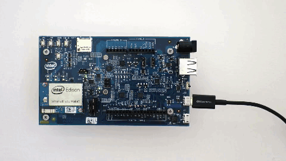
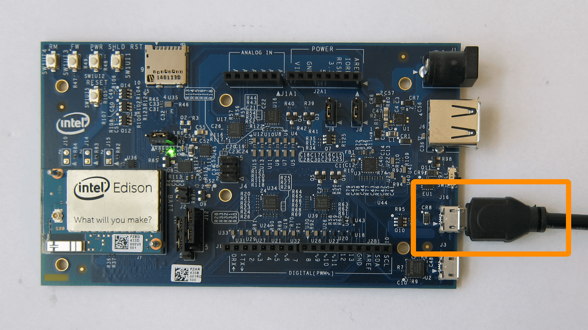
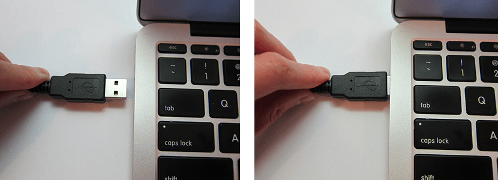
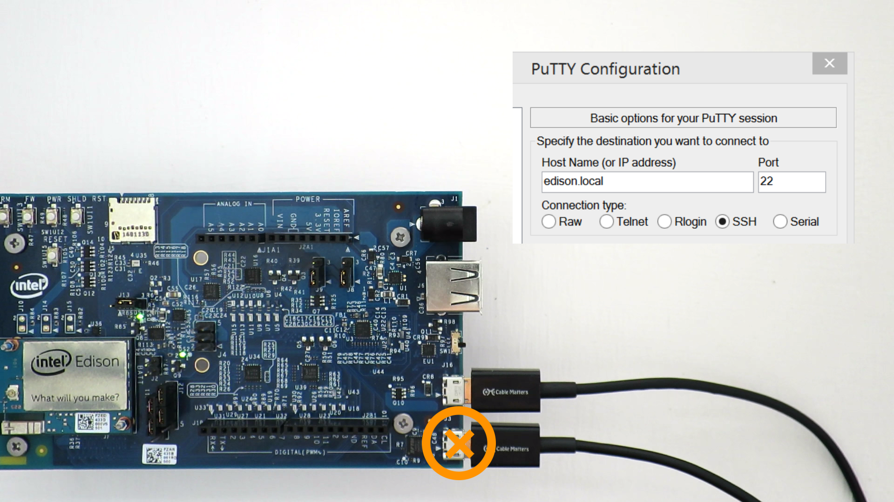

## UART/serial micro-USB cable

Use the bottom micro-USB port to send serial commands to your Intel® Edison via Terminal or PuTTY. Use these commands to flash firmware, configure Wi-Fi, or identify the board's IP address.

---

1. Power the Intel® Edison via the **device mode** micro-USB port and/or via the power barrel connector.

   or 

2. Plug a micro-USB cable into the **_bottom_** serial micro-USB connector on the expansion board. 

  

3. Connect the other end of the USB cable into your computer.

  

---

Refer to [Shell Access](/shell_access/) for more instructions on gaining command line access.

---

Once your Intel® Edison is online and has an addressable IP address, you may find it more convenient to [SSH into your board]() to run Linux commands. In that case, you will not need the micro-USB serial cable on a regular basis.

---