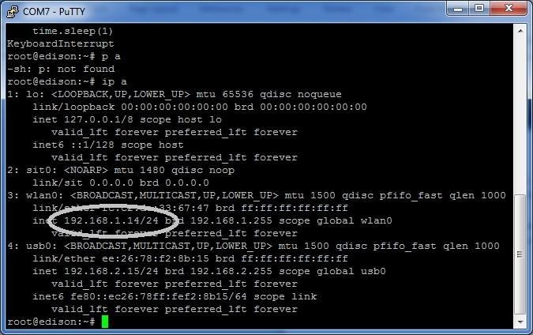

## Get Your IoT Board Online

Instructions for the **Intel® Edison**

This setup document will guide you through connecting the Intel® Edison board to the Internet using Wi-Fi.

Naturally, an important part of an Internet of Things project is access to the Internet. The Intel® Edison has built-in Wi-Fi that you can turn on by logging into your board and enabling.

Once your board is online, turn your Intel® Edison into a true "Internet of Things" device. You will also need the IP address of your Intel® board to program it using the Intel® IoT Developer Kit IDEs.

**Related videos**

[Get Your Intel Edison Online (preview)]()


**Table of contents**

* [Connect to a Wi-Fi network](#connect-to-a-wi-fi-network)
* [Identify the IP address](#identify-the-ip-address)

---

**What network is your computer using?**

To avoid any issues with firewalls and proxies, the IoT board and your computer should be on the same internet network. 

Note: Many larger companies have strict internet security policies and restrict direct IP address access of computers and devices that are on the same internal network. 

---


## Connect to a Wi-Fi network

Shell into your Intel® Edison and run the `configure_edison --wifi` command. Choose a Wi-Fi network to connect to and input any login credentials for that network.

1. Establish a serial connection to the Intel® Edison.

	_Don't know how? Refer to [Shell Access](../README.md#3-shell-access)._

2. Use the "configure_edison" command with the "--wifi" flag to start the wifi configuration process.

	```
	configure_edison --wifi
	```

	---

	**Get a "configure_edison: not found" message?**
	
	You need to update your Edison firmware. Refer to Flash Edison Firmware Manually for instructions. 
	
	Or, if you are using Windows 64-bit, a streamlined firmware flashing process is included with the Windows 64-bit integrated installer. Refer to Set Up Your Computer - Windows (64-bit integrated installer).

	---

1. If you are asked if you want to set up the wifi, type "**Y**" and press Enter. (This prompt will occur on older Intel® Edison firmware only.)

1. The Intel® Edison will scan for Wi-Fi networks and display a list of available networks when finished.

	

	If you do not see any networks, but you know they exist, try re-scanning by entering "0", or repeat steps 2-3.

1. Locate the network you would like to connect to in the list and enter the **corresponding number** in the prompt. Press Enter. 

	To confirm your entry, type "**Y**" and press Enter.

	

	In this example, to connect to "kafka" use the number “16”.

1. The network in this example requires a password. Your network might require other information. Enter the appropriate network credentials. Press Enter when finished. 

	

1. The Intel® Edison will attempt to make a connection to the network.

---

When you see a "Done" message, you are now connected to a Wi-Fi network.

---

---

**Failed connection?**

If the connection fails, you may have typed in your credentials incorrectly.  Try again by typing in "configure_edison --wifi" and repeating the steps again.

If you cannot get online using Wi-Fi but need to program your board using the Intel® IoT Developer Kit IDEs, try Ethernet over USB instead.

---

## Identify the IP address

Once your Intel® Edison is online, identify the IP address in order to: manually add an IP to an Intel® IoT Developer Kit IDE, use with SSH clients, or use your IoT device as a web server.

1. Establish a serial connection to the Intel® Edison.

	_Don't know how? Refer to [Shell Access](../README.md#3-shell-access)._

2. In newer versions of the Intel® Edison firmware you can use the "configure_edison" command.

	```
	configure_edison --showWiFiIP
	```

3. If the "--showWiFiIP" is not available to you, use the "**ip a**" command to output details of your network connection.

	```
	ip a
	```

4. It should be listed as "**wlan0**", inside the third listed entry. 

	

	In this example, the IP address is "192.168.1.14". The number after the slash ("24") is the netmask (which we do not have to worry about here).


	---
	
	**Do not see an IP address in the "wlan0" entry?**
	
	Your Intel® Edison is not online via Wi-Fi. You may need to re-run the steps in Connect to a Wi-Fi network.

	----
	
---

### Next Steps

Based on your programming language preference, install an IDE for Intel® IoT development:

* **For C/C++:**
  * [Set Up IoT Dev Kit Eclipse »](../set_up_eclipse/setup.md)

* **For JavaScript:**
  * [Set Up Intel XDK for IoT »](../set_up_xdk/setup.md)
