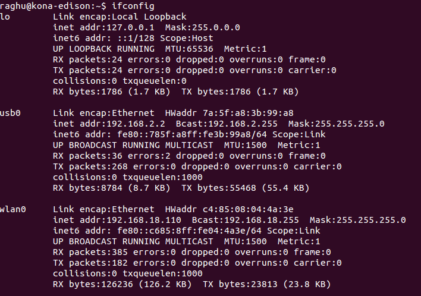

# Set Up Ethernet over USB - Linux

When you are in a busy or restricted network environment, connect to the Intel® Edison using the device mode micro-USB cable and a virtual Ethernet connection known as "Ethernet over USB". Ethernet over USB uses the RNDIS protocol.

This document will guide you through obtaining an IP address for the Intel® Edison in order to program your board offline using the Intel® IoT Developer Kit IDEs.


**Table of contents**

* [Forward usb0 connection »](#forward-usb0-connection)
* [Share your computer's WiFi connection (optional) »](#share-your-computers-wifi-connection-optional)


## Forward usb0 connection

Use Terminal and the `ifconfig` command to forward connections to the IP address 192.168.2.2 through "usb0" which should be the USB cable.

1. Open a new Terminal window.

2. Make sure your IoT board has the microswitch set to **device mode** and plug in the **device mode micro-USB cable** from your Intel® Edison to your computer. 

  Wait one minute for the Intel® Edison to finish booting up.

  

  _Refer to [Device mode micro-USB cable](/assembly/arduino_expansion_board/details-device_mode_cable.md) for full assembly instructions._

3. Use the `ifconfig` command to forward connections to the IP address "192.168.2.2" through "usb0" which should be the USB cable. You may be prompted for your user password.

  ```
  sudo ifconfig usb0 192.168.2.2
  ```

  ---

  **Can't see usb0?**

  Try this command first: 

  ```
  sudo ifconfig usb0 up
  ```

  ---

---

If you type the `ipconfig` command, you should see "192.168.2.2" for the usb0 entry:



See [Once connected...](once_connected.md) for what you can do now.

---


## Share your computer's WiFi connection (optional)

Turn on Internet Sharing to cut down on Wi-Fi traffic in a crowded room. Sharing your computer's internet connection also means that you can log into networks that have HTML password pages and then share the connection with the Intel® Edison.
Internet sharing is an optional step but is highly recommended if you are at a hackathon.

1. (These steps coming soon! Please do a pull request with screenshots/commands if you can.)

2. Use Terminal to establish a serial connection to the Intel® Edison.

  _Don't know how? Refer to [Shell Access](/shell_access/linux/serial_connection.md)._

3. On your Intel® Edison, disconnect from any WiFi networks the board might be logged into using the wireless command line interface (`wpa_cli`) command:

  ```
  wpa_cli disconnect
  ```

4. Then use the `route` command to add a default gateway. Use the same static IP address you set in the **Network** settings in the previous section.

  ```
  route add default gw 192.168.2.2
  ```

---

You can now use the Intel® Edison as if it is connected to the internet on its own as long as you keep the device mode micro-USB cable plugged in.

Try pinging a network from Terminal to make sure the Intel® Edison is connected to the internet through your computer's network connection:

```
ping google.com
```

(Use the Ctrl+C keyboard command to exit the ping process.)

To re-enable WiFi on the Intel® Edison, use the `configure_edison --wifi` command as described in [Connect Your Intel Edison to Wi-Fi](/connectivity/wifi/connect.md).

---

### Troubleshooting 

Unable to ping anything from the Intel® Edison?

* Unplug and replug the device mode micro-USB cable to reset the Ethernet over USB connection.

---

### Additional Resources

See what you can do [once connected »](once_connected.md)

---

### Next Steps

Based on your programming language preference, install an IDE for Intel® IoT development:

* **For C/C++:**
  * [Set Up IoT Dev Kit Eclipse »](/ide_setup-eclipse/setup.md)

* **For JavaScript:**
  * [Set Up Intel XDK for IoT »](/ide_setup-xdk/setup.md)


