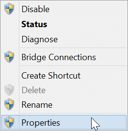
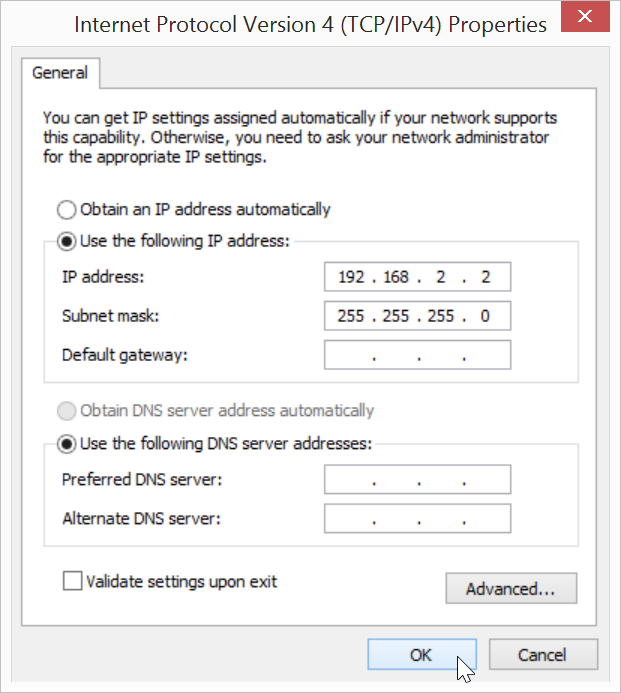

## Add static IPv4 address

If you have the Intel® Edison Drivers installed, update your computer's Network Adapter configuration with a static IP address to use Ethernet over USB.

---

**Have you installed the Intel® Edison Drivers?**

If you have not followed [Set Up Your Computer - Windows (64-bit integrated installer)](/computer_setup/windows/64bit_integrated_installer.md) or [Set Up Your Computer - Windows (manual installation)](/computer_setup/windows/manual_installation.md), please do so now. RNDIS drivers are included with the Intel® Edison Drivers.

---

1. View your **Network Connections**.

  * **Windows 8**: 
    1. Right-click on the Start menu button.
    2. Select "**Network Connections**".

  * **Windows 7 and below**: 
    1. Go to the Windows Control Panel. 
    2. Under "**Network and Internet**", click "**View network status and tasks**".

       

    3. Click "**Change Adapter Settings**" in sidebar.

      

2. Make sure your IoT board has the microswitch set to **device mode** and plug in the **device mode micro-USB cable** from your Intel® Edison to your computer. 

  Wait one minute for the Intel® Edison to finish booting up.

  

  _Refer to [Device mode micro-USB cable](/assembly/arduino_expansion_board/details-device_mode_cable.md) for full assembly instructions._

3. **Right-click** on the "**Local Area Connection**" network adapter entry with the label "**Intel Edison USB RNDIS Device**", then select "**Properties**".

  

  

4. In the new "Local Area Connection Properties" window, select "**Internet Protocol Version 4 (TCP/IPv4)**" from the list, then click "**Properties**".

  

5. In the new dialog window, select "**Use the following IP address**" and change the IP information as follows:

  * **IP address**: 192.168.2.2

  * **Subnet m****ask**: 255.255.255.0 (default)

  

6. Click "OK" to apply your changes and close the IPv4 properties window. 

  ---

  **IP address taken?**

  If you get a system notification that 192.168.2.2 is taken, try any IP address within the ranges of 192.168.2.1 to 192.168.2.14. 

  Do ***not*** use 192.168.2.15 which is already reserved for the USB Gadget network interface.

  ---

7. Click "Close" in any remaining network dialog windows that are open.

---

There is no noticeable difference to the "Local Area Connection" adapter icon. See [Once connected...](/connectivity/ethernet_over_usb/shared/once_connected.md) to confirm a successful connection to the Intel® Edison.

---