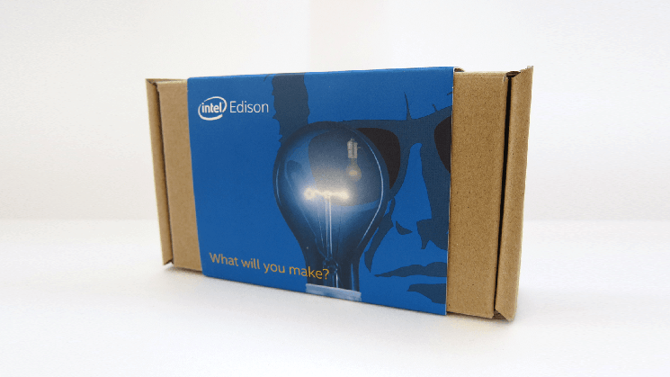
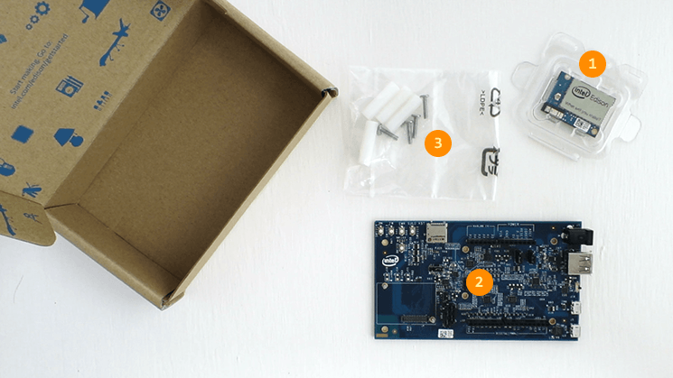
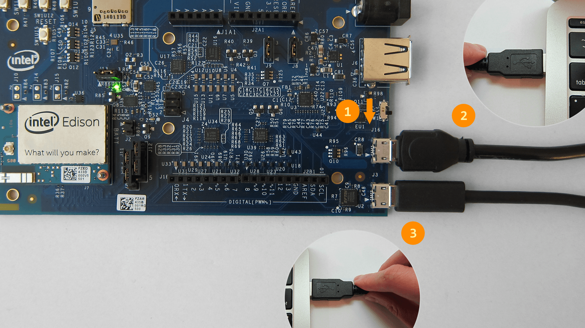

# Unboxing and Assembly

Find out what is in your Intel® Edison Kit for Arduino box. Some assembly is required. ;)

* [Look in the Intel® Edison Kit for Arduino box »](#look-in-the-intel-edison-kit-for-arduino-box)
* [Quick Start Assembly Instructions »](#quick-start-assembly-instructions)
  * [Install the Intel® Edison module »](#install-the-intel-edison-module)
  * [Install the plastic spacers »](#install-the-plastic-spacers)
* [Example of a full development setup »](#example-of-a-full-development-setup)

  <object id="flashObj" width="565" height="367" classid="clsid:D27CDB6E-AE6D-11cf-96B8-444553540000" codebase="http://download.macromedia.com/pub/shockwave/cabs/flash/swflash.cab#version=9,0,47,0"><param name="movie" value="http://c.brightcove.com/services/viewer/federated_f9?isVid=1" /><param name="bgcolor" value="#FFFFFF" /><param name="flashVars" value="videoId=4117865880001&playerID=741496470001&playerKey=AQ~~,AAAArH1stHk~,LuRqJUw7MaeYQkat5frTpWWPINh71g7p&domain=embed&dynamicStreaming=true" /><param name="base" value="http://admin.brightcove.com" /><param name="seamlesstabbing" value="false" /><param name="allowFullScreen" value="true" /><param name="swLiveConnect" value="true" /><param name="allowScriptAccess" value="always" /><embed src="http://c.brightcove.com/services/viewer/federated_f9?isVid=1" bgcolor="#FFFFFF" flashVars="videoId=4117865880001&playerID=741496470001&playerKey=AQ~~,AAAArH1stHk~,LuRqJUw7MaeYQkat5frTpWWPINh71g7p&domain=embed&dynamicStreaming=true" base="http://admin.brightcove.com" name="flashObj" width="565" height="367" seamlesstabbing="false" type="application/x-shockwave-flash" allowFullScreen="true" swLiveConnect="true" allowScriptAccess="always" pluginspage="http://www.macromedia.com/shockwave/download/index.cgi?P1_Prod_Version=ShockwaveFlash"></embed></object>

## Look in the Intel® Edison Kit for Arduino box

<dl>

  <dt>Intel® Edison compute module</dt>
  <dd>Refer to the <a href="http://www.intel.com/support/edison/sb/CS-035277.htm">product brief</a> for specs.</dd>

  <dt>Intel® Edison kit for Arduino expansion board.</dt>
  <dd>Software and hardware pin-compatible with Arduino Uno R3 shields. Refer to the <a href="http://www.intel.com/support/edison/sb/CS-035275.htm">hardware guide</a> for specs.</dd>

  <dt>Small hex nuts (x2)</dt>
  <dd>For attaching the Intel® Edison module to the expansion board.</dd>

  <dt>Screws (x4) &amp; plastic spacers (x4)</dt>
  <dd>To keep the expansion board stable and lifted off of surfaces.</dd>

</dl>

## Quick Start Assembly Instructions

### Install the Intel® Edison module

The Intel® Edison module is meant to be used with breakout boards or custom PCBs. You will need to secure your Intel® Edison module to the Arduino expansion board before you can use it. 

[View detailed instructions »](details-install_module.html)

### Install the plastic spacers

To add stability to the expansion board and to help avoid accidental short circuits, attach the four plastic spacers supplied in your Intel® Edison box to act as "legs" for the expansion board. 

[View detailed instructions »](details-install_spacers.html)

## Example of a full development setup

While plugging in every cable is not required at this very moment, a development setup with serial communication for shell access would look like this:

1. **microswitch** in "USB device mode" (i.e. toggled **_down_** towards the micro-USB ports)
2. **device mode micro-USB cable** plugged into your computer
3. **UART/serial micro-USB cable** plugged into your computer

The Arduino expansion board for Intel® Edison can be powered via the DC power jack, the device mode micro-USB port, or both. This setup uses only a micro-USB cable for power.

### Next Steps

Explore when and how to use all the cables ports on the Intel® Edison kit for Arduino: [Connecting Cables »](connecting_cables.html)

* The Arduino name, logo and the graphics design of its boards are a protected trademark of Arduino and its partners.

