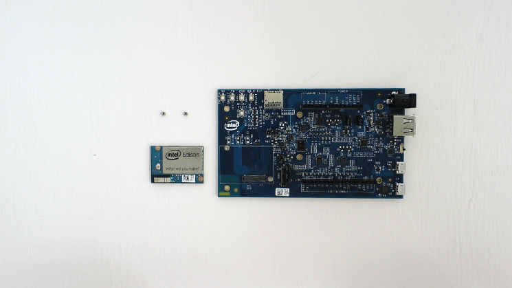
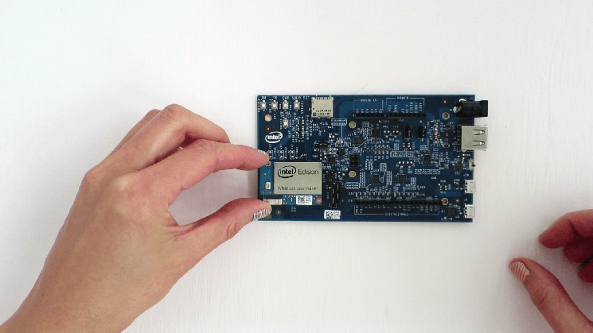
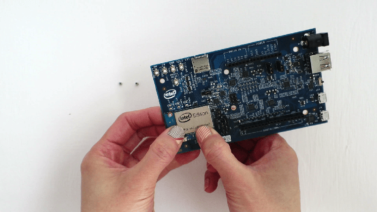
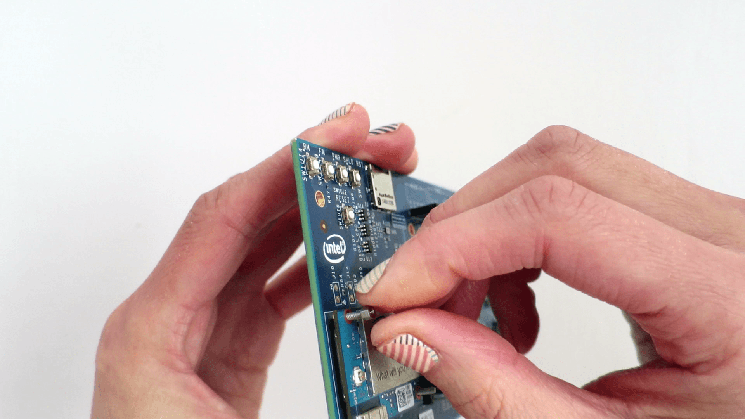

### Install the Intel® Edison module

The Intel® Edison module is meant to be used with breakout boards or custom PCBs. You will need to secure your Intel® Edison module to the Arduino expansion board before you can use it.

---

1. Locate the Intel® Edison module, Arduino expansion board, and two metal hex nuts.
  

2. Place the Intel® Edison module within the white outline on the Arduino expansion board, lining up the holes on the Intel® Edison module with the screws on the expansion board.
    

3. Press down on the Intel® Edison module just below the words "What will you make?" _until you feel a **snap**_.
  

4. Use the two hex nuts to secure the module to the expansion board. Hand tighten (but not too tight) the hex nuts onto the two screws that protrude through the board.
  

**Done!**

