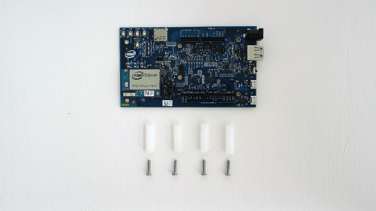
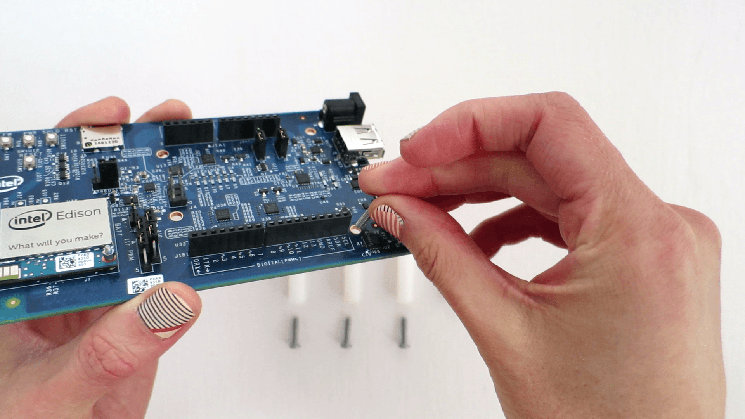
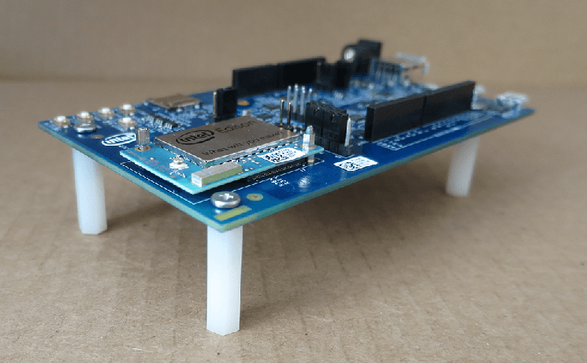

### Install the plastic spacers

To add stability to the expansion board and to help avoid accidental short circuits, attach the four plastic spacers supplied in your Intel® Edison box to act as "legs" for the expansion board.

---

1. Locate the four metal screws and four plastic spacers in the Intel® Edison Kit for Arduino box.
  

2. In one of the four holes in the corner of the Arduino expansion board, insert a screw through the top.
  

3. Twist and tighten one of the white plastic spacers onto the screw. The spacer should be on the **bottom** of the expansion board to act as legs.
  

4. Repeat for the remaining three screws and spacers.
  

**Done!**

