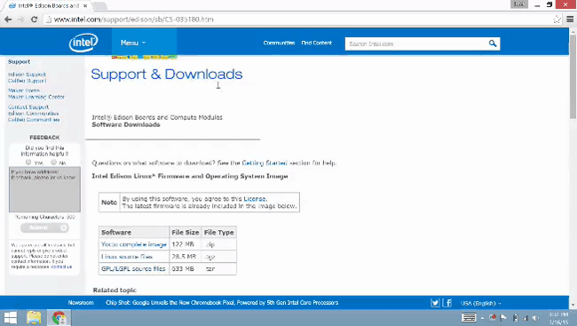

## Install Intel® Edison standalone drivers

The [Windows standalone drivers](https://software.intel.com/iot/hardware/edison/downloads) for Intel® Edison include several USB drivers in one installer package. These drivers enable important features, such as:

* Composite Device Class (CDC) for programming the board via the Arduino IDE,
* Remote Network Driver Interface Spec (RNDIS) for Ethernet over USB, and
* Device Firmware Upgrade (DFU) for updating firmware on devices.

---

1. Get the latest Intel® Edison Device USB drivers for Windows installer.

  * **Hackathon attendees:**
  
    1. On the USB key: files → Windows
    2. Copy **IntelEdisonDriverSetup[version].exe** to your computer.

  * **Online option:**

    1. Visit the Intel® Edison Software Downloads page: [software.intel.com/iot/hardware/edison/downloads](https://software.intel.com/iot/hardware/edison/downloads).
    2. Scroll down to the "**Driver software**" section. 
    3. Click the "**Windows Standalone Driver**" link to download **IntelEdisonDriverSetup[version].exe** to your computer.

2. Double-click on the **IntelEdisonDriverSetup[version].exe** on your computer to begin installation. 

  

3. Follow the installation wizard. Click "**Next**" where needed. The default settings can be adjusted to your needs if required but you may wish to leave the defaults as is. 

4. Click "**Finish**" to close the installation wizard.
