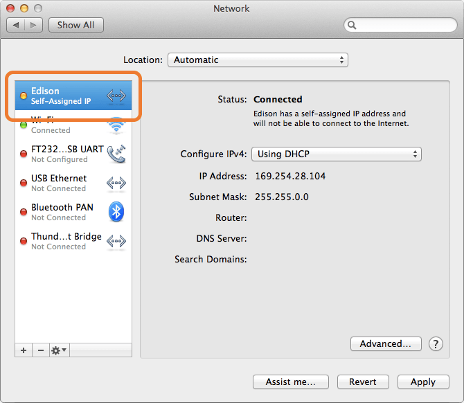
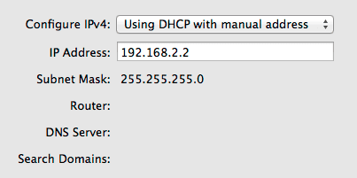
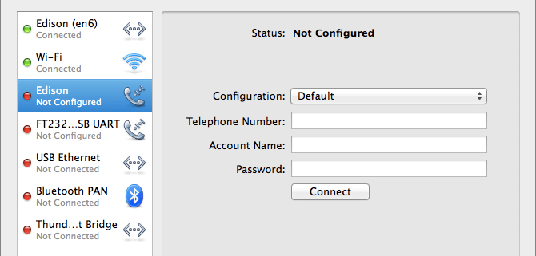

1. Open your **Network** preference settings.

    (i.e. In the OS X menu bar, choose  → System Preferences → Network)

2. Make sure your IoT board has the microswitch set to **device mode** and plug in the **device mode micro-USB cable** from your Intel® Edison to your computer. 

    Wait one minute for the Intel® Edison to finish booting up.

    

    _Refer to [Device mode micro-USB cable](../../../assembly/arduino_expansion_board/details-device_mode_cable.html) for full assembly instructions._

3. You should see an "**Edison**" entry (or "Multifunction Composite Gadget" if your Intel® Edison firmware is old) with a yellow dot status show up in the Network settings side panel on the left. 

    Select the "Edison" entry.

    

4. For "Configure IPv4", from the drop down choose "**Using DHCP with manual address**".

     

5. Change "IP Address" to be "**192.168.2.2**".

    

    Keep "Subnet Mask" at default "255.255.255.0".

6. Click "**Apply**". 

    

    **IP address taken?**

    If you get a system notification that 192.168.2.2 is taken, try any IP address within the ranges of 192.168.2.1 to 192.168.2.14. 

    Do not use 192.168.2.15 which is already reserved for the USB Gadget network interface.
    

You should see the yellow status dot turn green. 

See [Once connected...](../shared/once_connected.html) for what you can do now.

If you are on Mavericks, you may see multiple numbered "Multifunction Composite Gadget" or "Edison" service entries show up each time you plug in the same Intel® Edison. It is safe to delete old ones when done.

If you select one of the duplicate entries and do not see a "Configure IPv4" drop down, keep looking for the correct service entry to configure.

