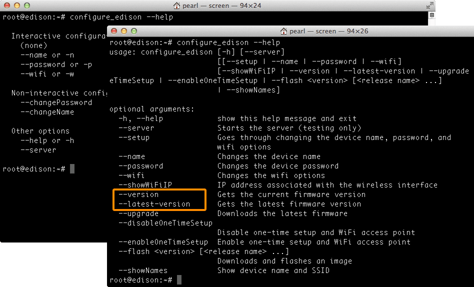

# Check installed firmware version

Find out what firmware version is currently flashed on your IoT board by running a few Linux commands directly on the Intel® Edison board.

1. Establish an SSH or serial connection to the Intel® Edison.

    _Don't know how? Refer to [Shell Access](/docs/shell_access/)._

2. Run the `configure_edison` command with the `--help` flag to figure out the right approach for your board based on the output of this command.

    ```
    configure_edison --help
    ```

    <div class="callout troubleshooting" markdown="1">
    **Get a "configure_edison: not found" message?**

    Your board's firmware is very out of date. [Update the firmware »](manually.html)

    

    ---

    **Do not see a "--version" flag in the command list?**

    Your board's firmware is out of date. [Update the firmware »](manually.html)

    
    </div>

3. If you see a "--version" flag and your Intel® Edison is online via the onboard Wi-Fi, run the `configure_edison` command with the `--version` flag, followed by the `--latest-version` flag.

    ```
    configure_edison --version; configure_edison --latest-version
    ```

    <div class="callout done" markdown="1">
    If the outputted numbers are the **same**, your board is up to date.

    

    In this example, the build version on the board is "120" and the latest is "120".
    </div>

    <div class="callout troubleshooting" markdown="1">
    **Is the first version number (yours) lower than the second (latest) version?**

    If so, your board's firmware is out of date. You may want to [update the firmware »](manually.html)

    In this example, the build version on the board is "16" but the latest is "17".
    </div>

4. If the `--latest-version` flag is not available because **your board is offline**, use the `cat` command to print out the text in the "/etc/version" file on the Intel® Edison.

    ```
    cat /etc/version
    ```

    <div class="callout troubleshooting" markdown="1">
    **See a build version number less than 120?**

    If you see something similar to "edison-weekly_build_56_2014-08-20_15-54-05", the build version number is 56.

    If you do not see "weekly-120" or higher outputted, your firmware is out of date. Continue to Update the firmware to enable all the newest features.
    </div>

<div class="callout info" markdown="1">
**Does the "Yocto complete image" file name on the Intel® Edison Software Downloads page indicate the build version?**

No, there is no direct naming correlation.

For example, the file name "edison-image-ww05-15.zip" means that this image was released the 5th week of the year 2015. Whereas "weekly-120" is what would be output when `configure_edison --version` is run with this image.
</div>

Return to [Flash Edison Firmware Manually »](manually.html)