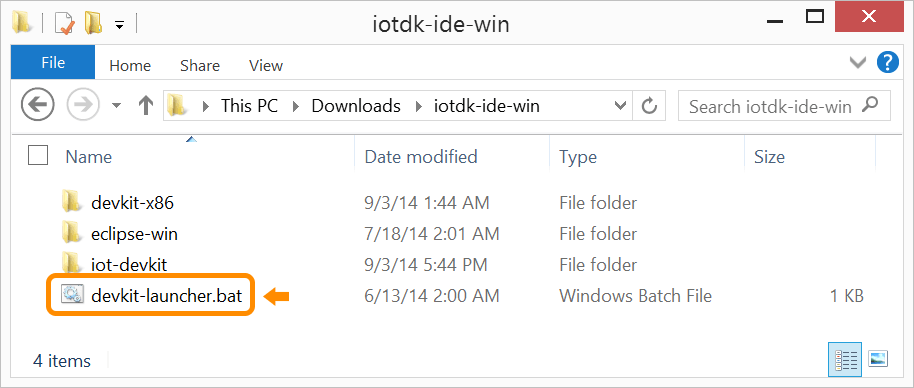
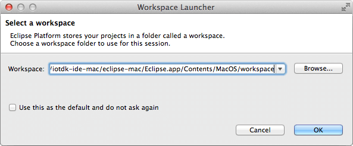
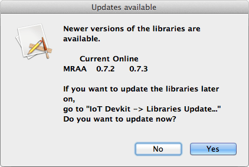
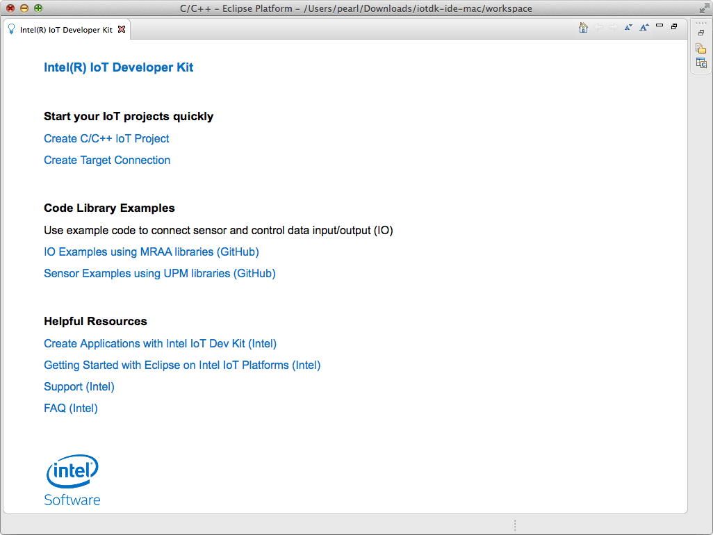
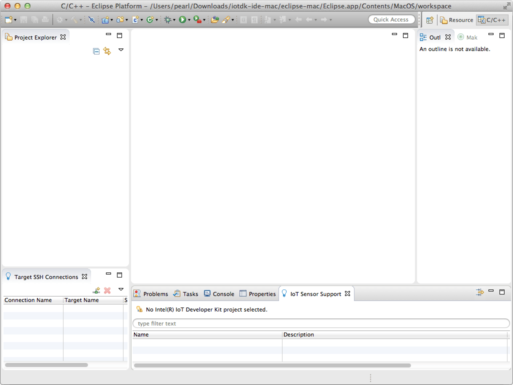

1. Once the archive file is extracted, go into the resulting iotdk-ide directory.

2. Double-click on devkit-launcher to launch the IoT dev kit Eclipse IDE.

    On Windows, you may need to right-click on devkit-launcher.bat and select "**Run as administrator**".

    

    You should see a command line window appear (and quickly disappear, if you are on Windows) and the Eclipse IDE will launch.

3. After launching Eclipse, you will need to select a folder to become your Eclipse workspace for project files.

    

    Click **OK** to keep the default workspace directory, or **Browse...** to select a different directory.

4. You may also see a popup indicating that updates are available.

    

    Click **Yes** to update.

    

5. A welcome screen will be displayed. Click the **X** (close button) next to the panel's tab title to dismiss this screen.
  
    

    

    To see this welcome screen again, select **IoT DevKit** > **Intel(R) IoT Developer Kit**

    
    

You should now see a fresh Intel® IoT Developer Kit workspace.

