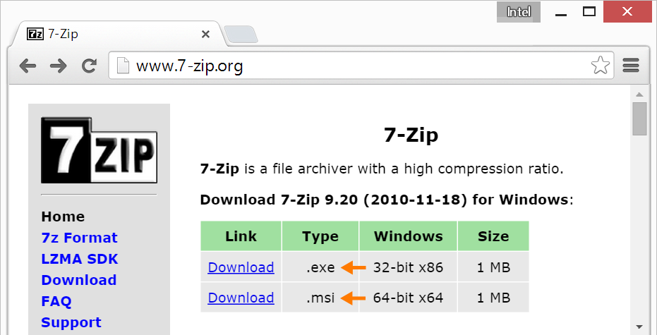
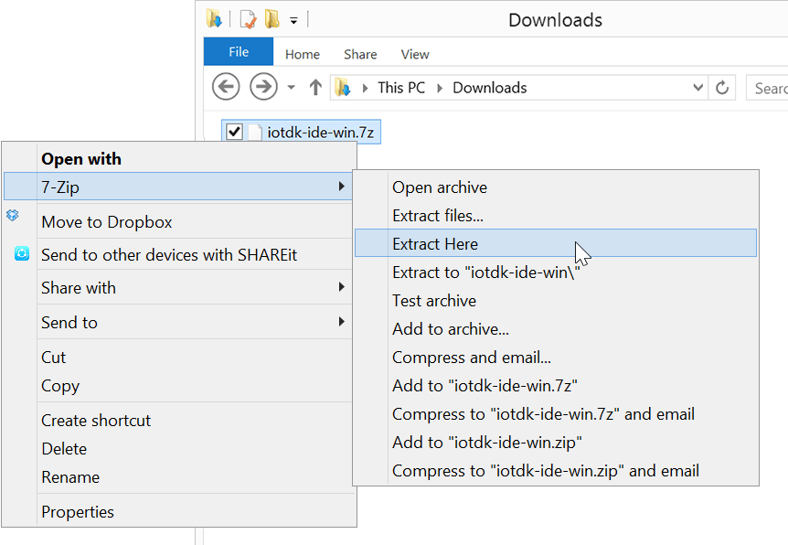

* [Install prerequisite software »](#install-prerequisite-software)
  * [Install 7Zip (Windows only) »](#install-7zip-windows-only)
  * [Install Java »](#install-java)
* [Extract Intel® IoT dev kit Eclipse IDE »](#extract-intel-iot-dev-kit-eclipse-ide)
* [Launch Eclipse using batch file »](#launch-eclipse-using-batch-file)

# Set Up Intel® IoT Dev Kit Eclipse - Part 1: Installation

The Intel® IoT Developer Kit ("dev kit") lets you create and test applications on Intel® IoT platforms. The Eclipse IDE distributed with the dev kit facilitates writing IoT applications in C and C++.

This document will guide you through installing the Eclipse IDE distributed with the Intel® IoT Developer Kit for Intel® Edison development.

<!-- 

* [Set Up Intel IoT Dev Kit Eclipse – Part 1: Installation](https://software.intel.com/en-us/videos/set-up-intel-iot-dev-kit-eclipse-part-1-installation)

 -->

## Install prerequisite software

Depending on your computer's operating system, you may need to install additional software in order to use the dev kit version of Eclipse.

### Install 7Zip (Windows only)

[7zip](http://www.7-zip.org) supports extended file paths which some of the contents of the compressed file have so only use 7zip software to extract the file. 

View detailed instructions for:
[Windows »](details-install_7zip.html){: .link-button}

### Install Java

Eclipse depends on either a Java Runtime Engine (JRE) or Java Development Kit (JDK). Check if you have Java installed and, if you do not, install it. 

View detailed instructions for:
[Windows »](details-install_java-windows.html){: .link-button} [Mac »](details-install_java-mac.html){: .link-button} [Linux »](details-install_java-linux.html){: .link-button}

## Extract Intel® IoT dev kit Eclipse IDE

Copy the compressed archive containing the IoT-customized Eclipse IDE to your computer and extract the contents.

View detailed instructions for:
[Windows »](details-extract_iot_eclipse-windows.html){: .link-button} [Mac »](details-extract_iot_eclipse-mac.html){: .link-button} [Linux »](details-extract_iot_eclipse-linux.html){: .link-button}

## Launch Eclipse using batch file

Use devkit-launcher.bat to launch Eclipse with all the necessary Intel® IoT environment settings. Use the launcher batch file (instead of eclipse.exe) to launch Eclipse **every time**. 

[{: .animated data-still="images/launch_eclipse-sampleframe.jpg" data-animated="images/launch_eclipse-animated.gif"}](details-launch_eclipse_batch.html)

[View detailed instructions »](details-launch_eclipse_batch.html){: .link-button .centered}

Refer to the [Troubleshooting »](troubleshooting.html)

### Next Steps

Create and run a Hello Word project (blinking the onboard LED) on the Intel® Edison.

[Run a Sample Eclipse Project »](index-create_project.html){: .link-button .centered}

