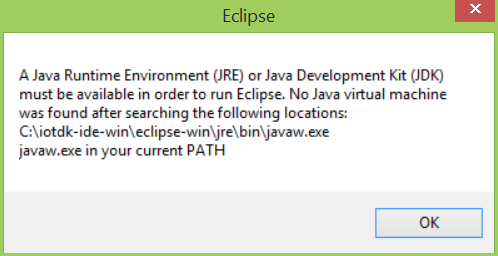

<div id="toc" markdown="1">
* [Do you have spaces in any of your folder names?](#do-you-have-spaces-in-any-of-your-folder-names)
* [Mac only: Get a "devkit-launcher can’t be opened because it is from an unidentified developer" message?](#mac-only-get-a-devkit-launcher-cant-be-opened-because-it-is-from-an-unidentified-developer-message)
* [Windows only: Get a "No Java virtual machine" message?](#windows-only-get-a-no-java-virtual-machine-message)
* [Windows only: Get a "Windows cannot find eclipse.exe" message?](#windows-only-get-a-windows-cannot-find-eclipseexe-message)
* [Does a command line window appear, disappear, and then nothing happens?](#does-a-command-line-window-appear-disappear-and-then-nothing-happens)
* [Adding a Library to an Eclipse Project](#adding-a-library-to-an-eclipse-project)
</div>

# Troubleshooting - IoT DevKit Eclipse IDE

Some common issues have been listed below. For additional troubleshooting and FAQ, visit [software.intel.com/en-us/articles/eclipse-faq-for-iot-build](https://software.intel.com/en-us/articles/eclipse-faq-for-iot-build). 

## Do you have spaces in any of your folder names?

If the full file path to the iotdk-ide folder contains spaces, the batch file may not work. If you cannot move iotdk-ide, you may need to edit devkit-launcher and hardcode the full file path.

For example, change the first line:

```
export DEVKIT_HOME=$(dirname $0)/
```

To be:

```
export DEVKIT_HOME="/my parent folder/iotdk-ide-mac/"
```


## Mac only: Get a "devkit-launcher can’t be opened because it is from an unidentified developer" message?

1. Right-click on devkit-launcher.bat and select "Open with". 
2. Select the Terminal app. 
3. In the new popup, confirm running the batch file by clicking "Open". 
4. You should only have to do this once.


## Windows only: Get a "No Java virtual machine" message?



Refer to [Install Java](details-install-java.md) to install a JRE or JDK.


## Windows only: Get a "Windows cannot find eclipse.exe" message?


You are trying to open this dev kit package on a 32-bit Windows OS. You will need to make some adjustments to your dev kit package:

1. Download and extract the Arduino IDE for Windows (version 1.6.4+) from [http://www.arduino.cc/en/Main/Software](http://www.arduino.cc/en/Main/Software).

2. In the extracted Arduino IDE folder, go into "hardware\tools\edison\sysroots\" and copy the whole "i686-pokysdk-mingw32" directory.

3. In the "iotdk-ide-win" folder, go to the "\devkit-x86\sysroots" folder and put the copied "i686-pokysdk-mingw32" folder here.

4. Edit the devkit-launcher.bat script using Notepad or any other text editor. 

    Change this line: 

    ```
    set PATH=%PATH%;%DEVKIT_HOME%\devkit-x86\sysroots\x86_64-pokysdk-mingw32\usr\bin\i586-poky-linux;%DEVKIT_HOME%\iot-devkit\devkit-debugger
    ```

    To be:

    ```
    set PATH=%PATH%;%DEVKIT_HOME%\devkit-x86\sysroots\i686-pokysdk-mingw32\usr\bin\i586-poky-linux;%DEVKIT_HOME%\iot-devkit\devkit-debugger
    ```

5. Download the "Windows 32-bit" version of Eclipse IDE for C/C++ Developers from https://eclipse.org/downloads/packages/eclipse-ide-cc-developers/keplersr2.

6. Extract the 32-bit version of Eclipse and use it to replace the eclipse found in the "iotdk-ide-win" folder.
Now use devkit-launcher.bat to launch Eclipse..


## Does a command line window appear, disappear, and then nothing happens?

The batch file is not working with your current development setup. Run the batch file via the command line to see any errors messages and try to manually resolve.

1. From the Windows Start menu, select "Run".

2. Type `cmd`.

3. In the command line window, `cd` into the directory where the devkit-launcher.bat is. 
  e.g. `cd c:\Users\[Username]\Downloads\iotdk-ide-win`
  Type `devkit-launcher` and press Enter.

  Look closely at the output for error messages.

## Adding a Library to an Eclipse Project

Oftentimes when you are building a project and using a particular sensor, you must include the UPM library for that sensor in your Eclipse project.
