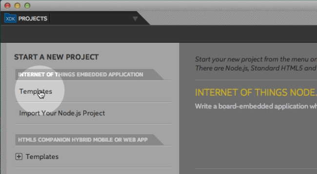
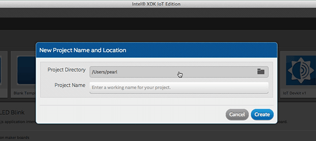
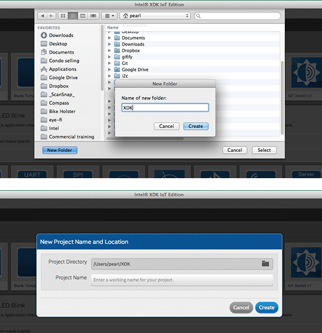
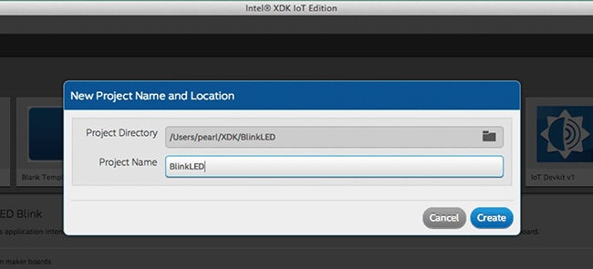

1. Under the "**Internet of Things Embedded Application**" option in the lefthand menu, select "**Templates**".

    

2. A list of templates for developing Node.js applications will be shown. Select "**LED Blink**".

    
    
3. Click **Continue** in the bottom right.

    

4. Choose a project directory for your project files.

    

    If this is the first time using the Intel® XDK, we recommend creating a separate "**XDK**" folder for your files. 

    

5. Enter a name for your project such as "**BlinkLED**".

    

5. Click "**Create**".

    

6. A popup will confirm the successful creation of your Blink LED project. 

    If this is the first time using the Intel® XDK, we recommend you take the <em>Quick Tour</em>.

    

**See a "Bonjour is missing" message? (Windows only)**

Complete the steps in [Install Bonjour](../installation/details-install_bonjour.html).

