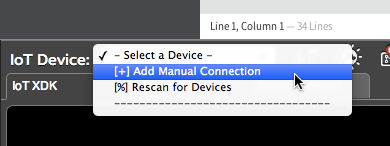
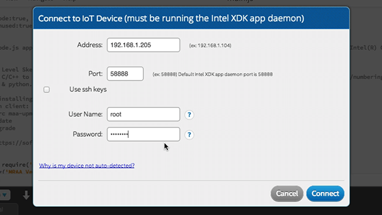
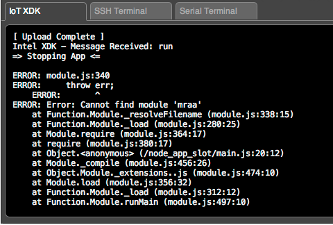
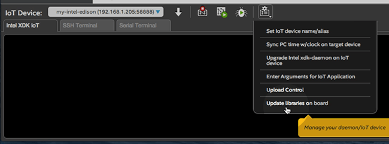

<div id="toc" markdown="1">
* [Problems with Wi-Fi? Need to program while offline?](#problems-with-wi-fi-need-to-program-while-offline)
* [Don't see your device in the "IoT Device" drop down list?](#dont-see-your-device-in-the-iot-device-drop-down-list)
  * [Add a device manually](#add-a-device-manually)
  * [Restart the Intel® XDK app daemon](#restart-the-intel-xdk-app-daemon)
* [Get a “cannot find module mraa” message?](#get-a-cannot-find-module-mraa-message)
* [Auto-run projects upon upload](#auto-run-projects-upon-upload)
* [Install Node modules](#install-node-modules)
* [Additional resources](#additional-resources)
</div>

# Troubleshooting - Intel® XDK

Some common issues have been listed below. For additional troubleshooting and FAQ, visit [software.intel.com/en-us/articles/intel-xdk-iot-edition-troubleshooting-and-faq](https://software.intel.com/en-us/articles/intel-xdk-iot-edition-troubleshooting-and-faq). 

## Problems with Wi-Fi? Need to program while offline?

The Intel® XDK requires the IP address of your IoT board in order to program it. If your IoT board is online, the IP address is automatically detected in most cases. 

However, if you are unable to get your IoT board online to the same network as your computer due to restricted or busy Wi-Fi networks, try [Ethernet over USB](../../../connectivity/ethernet_over_usb/) and <span class="icon bookmark">[Add a device manually](#add-a-device-manually)</span> to the drop down list.

## Don't see your device in the "IoT Device" drop down list?

* Check that your Intel® IoT board is online via Wi-Fi or ethernet, and that your development computer is on the same network as the IoT board.

* If your internet network requires additional login credentials (e.g. a university Wi-Fi network), you may need to add the IP address manually. Refer to <span class="icon bookmark">[Add a device manually](#add-a-device-manually)</span> below.

* If you are using Ethernet over USB for the Intel® Edison, you may need to add the IP address manually. Refer to <span class="icon bookmark">[Add a device manually](#add-a-device-manually)</span> below.

### Add a device manually

You will need to add the IP address of your IoT device manually if you are using:

* Ethernet over USB for the Intel® Edison, or
* an internet network that requires additional login credentials (e.g. a university Wi-Fi network)

1. From the "**IoT Device**" drop down list, select "**Add Manual Connection**".

    

2. A dialog window will appear to input the login credentials of your Intel® Edison.

    

    * **Address:** 
        * Refer to [Identify the IP address](../../../connectivity/wifi/details-identify_ip.html) find your IP address when it is not discoverable. 
        * Or use "**192.168.2.15**" if you're using [Ethernet over USB](../../../connectivity/ethernet_over_usb/).
    * **Port:** Leave port as "**58888**"
    * **User Name:** Unless you have changed it, use "**root**"
    * **Password:** Unless you have changed it, use "**intel123**"

3. Click "**Connect**" to try connecting to the IoT device using the manual settings.


### Restart the Intel® XDK app daemon

The Intel® XDK app daemon may not be running on the Intel® IoT board.

1. Establish a serial connection to your Intel® Edison. 

2. Use the `systemctl` command to enable and restart the xdk-daemon on the IoT board.

    ```
    systemctl enable xdk-daemon
    systemctl restart xdk-daemon
    ```

3. Re-check the "IoT Device" drop down list for your device.


## Get a "cannot find module mraa" message?



If you see this error message, your board is missing libmraa, a library for GPIO communication on Linux platforms. 

1. In the bottom toolbar, click the "**Manage your daemon/IoT device**" icon.

2. Click the "**Update libraries on board**" option.

    

3. After updating the MRAA libraries, click the "**Run**" icon again to re-run the project on the device.

If you continue to see errors, you may need to update MRAA manually. 

Connect to your IoT board via serial or SSH. Then run the following commands: 

```
echo "src mraa-upm http://iotdk.intel.com/repos/1.1/intelgalactic" > /etc/opkg/mraa-upm.conf
opkg update
opkg install libmraa0
```

## Auto-run projects upon upload

By default (in Intel® XDK version 2571 and higher), projects do not auto start upon upload completion.


To change this behavior:

1. In the bottom toolbar, click the "**Manage your daemon/IoT device**" icon.

2. Click "**Upload Control**".

3. In the "**Automatic Start**" section, select "**Automatically run after upload**".

4. Click "**OK**" to save your options and close the dialog window.

5. Click the "**Upload**" icon again to re-upload the project on the device and see it auto-start.


## Install Node modules

If you have any dependencies listed in **package.json**, clicking the "**Upload**" icon will also fetch all the Node modules specified in `"dependencies": {}` and install them on the IoT device.


## Additional resources

For additional help using the Intel® XDK, explore the articles or videos listed below.

* Official [Intel® XDK Documentation](https://software.intel.com/en-us/html5/xdkdocs)

* [Intel® IoT Edition Demo Video](https://software.intel.com/en-us/html5/iot-demo) (video)

* [Securely Accessing Your Internet of Things (IoT) Device](https://software.intel.com/en-us/html5/documentation/secure-communication-intel-xdk-iot-edition)

* [Removing Intel® XDK Local Data on Windows, Apple OS X, & Linux](https://software.intel.com/en-us/html5/blogs/remove-xdk-local-data)
