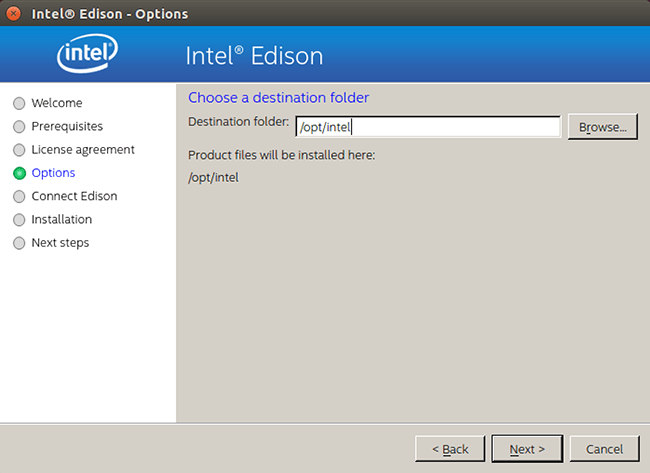
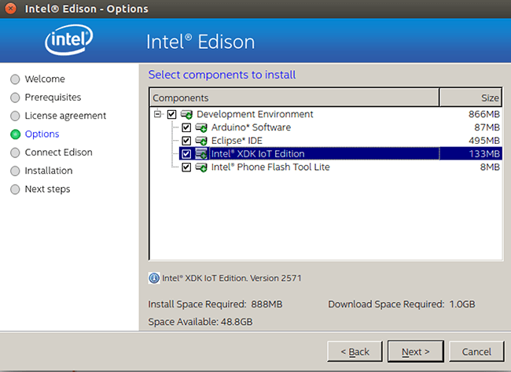
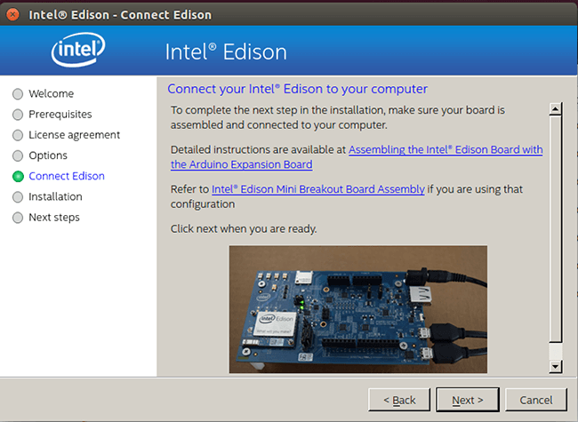
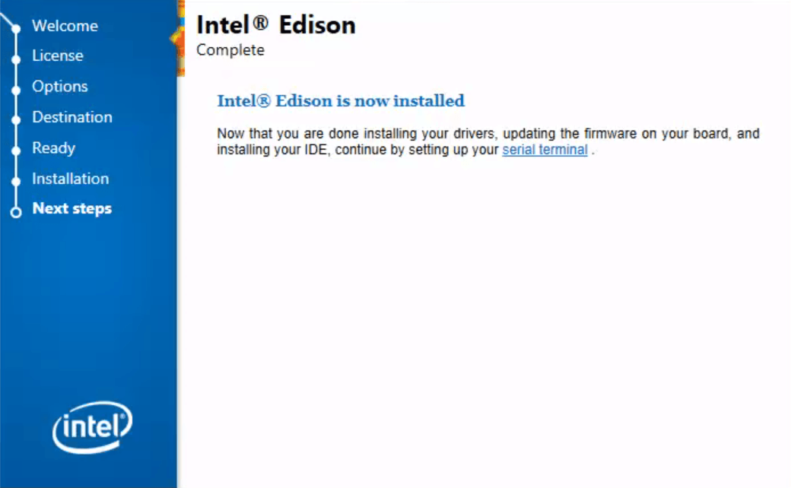

1. Get the latest Intel® IoT DevKit offline installer files.

    

    1. On the USB key: downloads
    2. Copy the entire Linux folder to your computer
    

2. When the file transfer is complete, go into the Linux folder you copied to your development machine.

3. Extract l_iot_dev_kit_[version].tar.gz to the same directory. 

4. Go into the extracted folder l_iot_dev_kit_[version].

5. Launch install.sh to start the installer.

    

6. Follow the installation wizard prompts. Click **Next** where needed.

7. When you reach the "**Installation Summary**" screen, click **Customize installation**.

    

8. Click **Next** on the "**Choose a destination folder**" screen.
    
      

9. On the "**Select components to install**" screen, ***select one or more*** of the IDEs to install: 

    * **Arduino™ Software** -- for simplified C++ development 
    * **Eclipse™ IDE** -- for C/C++ development
    * **Intel® XDK IoT Edition** -- for JavaScript / NodeJS development

    Leave the last option ***selected***:
    
    * **Intel® Phone Flash Tool Lite** -- installs tool to flash Intel® Edison firmware

    **WARNING: If you have a previous version of an IDE installed, it will be replaced.**
    
    Click **Next**.

    

10. On the "**Intel® Edison advanced options**" screen, leave "**Update firmware image**" selected to flash the latest firmware image directly on your Intel® Edison .

    

11. When prompted, connect the device mode and UART/serial cables to your computer, along with powering the board using DC power. 

    

    Click **Next** when ready. 

    If the Next button is greyed out, wait one minute for the Intel® Edison to finish booting up.

12. Follow the instructions for the Phone Flash Tool Lite installer when it appears, and click **Continue** or **Install** when prompted.

13. The entire flashing process may take up to 5-6 minutes. When done, click **Finish** to close the installation wizard.

    
