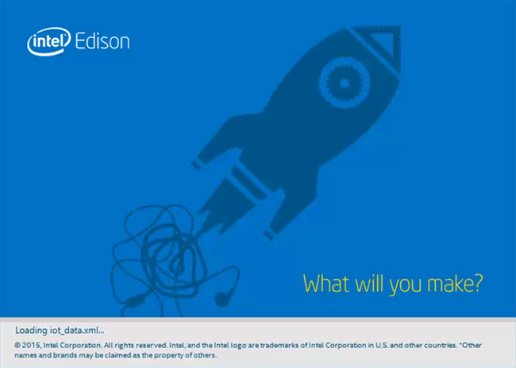
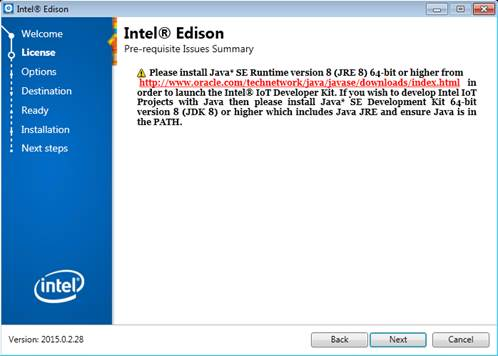
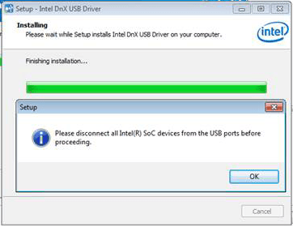

1. Get the latest Intel® IoT DevKit offline installer.

    

    1. On the USB key: downloads
    2. Copy the entire Windows folder to your computer
    

2. When the file transfer is complete, go into the Windows folder you copied to your development machine.

3. Double-click install.bat to start installer.

    NOTE: Installation requires administrative rights. If you get a “Do you want to allow following program to make changes to this computer” dialog, click **Yes**.

    

4. Follow the installation wizard prompts. Click **Next** where needed.

5. If you do not have the required Java version installed, you will see a message. 

    
  
    If you are planning on only using the XDK to program in Javascript or the Aruino IDE ignore the JDK warning message.
    
    
    If you are planning to use Eclipse IDE to program in C/C++ AND you see the message above, visit [oracle.com](www.oracle.com/technetwork/java/javase/downloads/index.html) to download _Java Platform (JDK) 8u65 / 8u66_ or higher.
    

    Install Java, then click **Next** in the Intel® IoT DevKit offline installer to continue.

6. When you reach the components option screen, leave the first three options ***selected***:
    * **Drivers** -- installs the Intel® Edison drivers and FTDI serial drivers for Windows,
    * **Intel® Phone Flash Tool Lite** -- installs tool to flash Intel® Edison firmware
    * **Update image** -- flashes the latest firmware image directly on your Intel® Edison 

    Under "**Development Environment**", ***select one or more*** of the IDEs to install: 

    * **Arduino™ Software** -- for simplified C++ development 
    * **Intel® XDK IoT Edition** -- for JavaScript / NodeJS development
    * **Eclipse™** -- for C/C++ development

    **WARNING: If you have a previous version of an IDE installed, it will be replaced.**

    Click **Next**.

    

7. Since you will be updating the firmware, connect the device mode and UART/serial cables to your computer, along with powering the board using DC power. 

    

    Click **Next** when ready. 

    If the Next button is greyed out, wait one minute for the Intel® Edison to finish booting up.

8. Follow the instructions on the screens and click **Install** or **Next** when prompted to continue with the installation wizard. 

    

    If prompted to disconnect all SoC devices, click **OK** to let installation continue.

9. The entire installation and flashing process may take up to 30 minutes. When done, click **Finish** to close the installation wizard.

    
