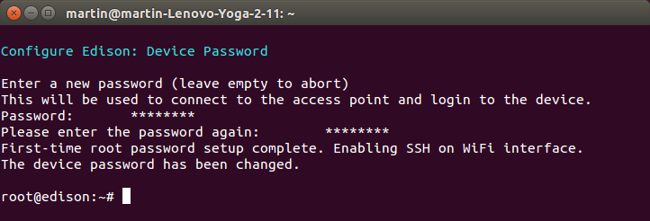

<div id="toc" markdown="1">
* [Install a shell session manager (Screen) »](#install-a-shell-session-manager-screen)
* [Establish a serial connection »](#establish-a-serial-connection)
</div>

# Shell Access - Linux


If you need to configure your IoT board, you will need to remotely connect to the Intel® Edison or Intel® Galileo. Once connected to your Intel® IoT board, you have access to the Linux-based Yocto operating system running on the board. 

You can then execute special Linux commands such: changing the hostname and password, setting up Wi-Fi, or flashing new firmware.

## Install a shell session manager (Screen)

<div class="tldr" markdown="1">
Your computer may not have come with a pre-installed shell session manager. Download and install the GNU Screen utility using `sudo apt-get install screen`. 
</div>

[View detailed instructions »](details-install_screen.html){: .link-button .centered}

## Establish a serial connection

<div class="tldr" markdown="1">
Use the Screen utility that you installed in the previous section to gain command line access of your IoT board. For example: `sudo screen /dev/ttyUSB0 115200`.
</div>

[View detailed instructions »](details-screen_connection.html){: .link-button .centered}

<br>

<div class="callout done" markdown="1">
You are now logged into your IoT board and can run shell commands. For example, try:

```
configure_edison --help
```
</div>

## First time setup

<div class="tldr" markdown="1">
You must enable SSH of WiFi in order to work with the Intel XDK and Eclipse. To do this configure the Intel Edison password:
</div>

```
configure_edison --password
```


Enter a password, but make sure you do not forget it. There is no way to recover a lost password without reflashing the board. 




<div id="next-steps" class="callout done" markdown="1">
You should now be able to gain command line access to the Intel® Edison.

[Continue to the next step in the START HERE guide »](../../index.html#done-shell-access){: .link-button .centered}
</div>