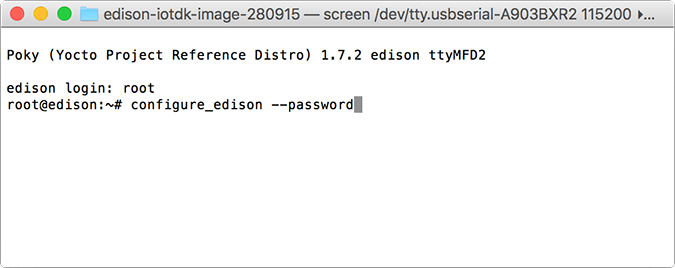

* [Identify the "usbserial" device name »](#identify-the-usbserial-device-name)
* [Establish a serial connection »](#establish-a-serial-connection)
* [Configure a password to enable SSH](#configure-a-password-to-enable-ssh)

# Shell Access - Mac 

If you need to configure your IoT board, you will need to remotely connect to the Intel® Edison or Intel® Galileo. Once connected to your Intel® IoT board, you have access to the Linux-based Yocto operating system running on the board. 

You can then execute special Linux commands such: changing the hostname and password, setting up Wi-Fi, or flashing new firmware.

## Identify the "usbserial" device name 

Use the `ls /dev/tty.*` command in Terminal to find the device name of the "**usbserial**" connection. You will need the exact device name for use in Establish a serial connection next. 

[{: .animated data-still="images/identify_usbserial-sampleframe.jpg" data-animated="images/identify_usbserial-animated.gif"}](details-identify_usbserial.html)

[View detailed instructions »](details-identify_usbserial.html){: .link-button .centered}

## Establish a serial connection

Use the Screen utility in Terminal to gain command line access of your IoT board. For example: `screen /dev/tty.usbserial-A102GW3T 115200`. 

[{: .animated data-still="images/screen_connection-sampleframe.jpg" data-animated="images/screen_connection-animated.gif"}](details-screen_connection.html)

[View detailed instructions »](details-screen_connection.html){: .link-button .centered}

## Configure a password to enable SSH 

You must enable SSH in order to work with the Intel® XDK and Eclipse over Wi-Fi. Setting a password on your Intel® Edison by running `configure_edison --password` will enable SSH.

[View detailed instructions »](details-configure_password.html){: .link-button .centered}

You are now logged into your IoT board and can run shell commands.

[Continue to the next step in the START HERE guide »](../../index.html#done-shell-access){: .link-button .centered}

