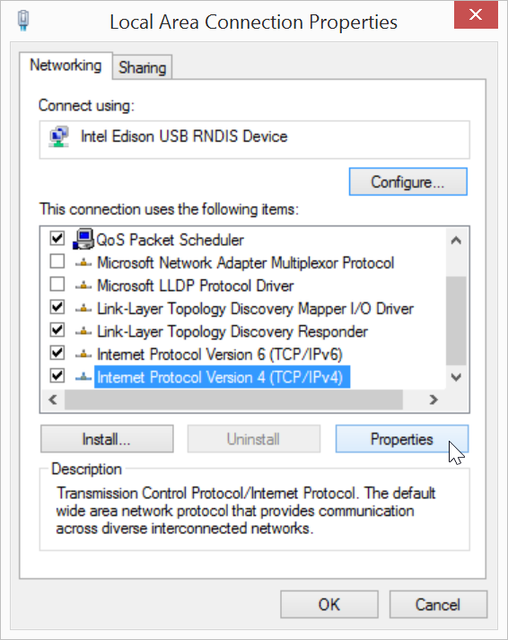

## Set Up Ethernet over USB - Windows

This document will guide you through obtaining an IP address for the Intel® Edison in order to program your board offline using the Intel® IoT Developer Kit IDEs.

When you are in a busy or restricted network environment, connect to the Intel® Edison using the device mode micro-USB cable and a virtual ethernet connection known as "Ethernet over USB". Ethernet over USB uses the RNDIS protocol.

**Table of contents**

* [Add static IPv4 address](#add-static-ipv4-address)
* [Share your computer's WiFi connection (optional)](#share-your-computers-wifi-connection-optional)

**Related videos**

[Ethernet over USB - Intel Edison - Windows (preview)]()

---

**Are you using the device mode micro-USB cable?**

In order to use Ethernet over USB, your Intel® Edison must have the microswitch set to device mode and the appropriate micro-USB cable plugged in. Refer to [Connecting Cables → Device mode micro-USB cable](../assembly-arduino_expansion_board/connecting_cables.md#device-mode-micro-usb-cable) for full assembly instructions.

---

## Add static IPv4 address

If you have the Intel® Edison Drivers installed, update your computer's Network Adapter configuration with a static IP address to use Ethernet over USB.

---

**Have you installed the Intel® Edison Drivers?**

If you have not followed Set Up Your Computer - Windows (64-bit integrated installer) or Set Up Your Computer - Windows (manual), please do so now. RNDIS drivers are included with the Intel® Edison Drivers.

---

1. View your **Network Connections**.

    1. **Windows 8**: 
		
		Right-click on the Start menu button. Select "**Network Connections**".

    2. **Windows 7 and below**: 

		Go to Control Panel. Under "**Network and Internet**", click "**View network status and tasks**". 

		Then click "**Change Adapter Settings**" in sidebar. 

	

	

2. Plug in the **device mode micro-USB cable** from your Intel® Edison to your computer. Wait one minute for the Intel® Edison to finish booting up.

3. **Right-click** on the "**Local Area Connection**" network adapter entry with the label "**Intel Edison USB RNDIS Device**", then select "**Properties**".

	

	

4. In the new "Local Area Connection Properties" window, select "**Internet Protocol Version 4 (TCP/IPv4)**" from the list, then click "**Properties**".

	
5. In the new dialog window, select "**Use the following IP address**" and change the IP information as follows:

    3. **IP address**: 192.168.2.2

    4. **Subnet m****ask**: 255.255.255.0 (default)

	

6. Click "OK" to apply your changes and close the IPv4 properties window. 

7. Click "Close" in any remaining network dialog windows that are open.

---

**IP address taken?**

If you get a system notification that 192.168.2.2 is taken, try any IP address within the ranges of 192.168.2.1 to 192.168.2.14. 

Do not use 192.168.2.15 which is already reserved for the USB Gadget network interface.

---

---

There is no noticeable difference to the "Local Area Connection" adapter icon. See [Once connected...](once_connected.md) to confirm a successful connection to the Intel® Edison.

---

## Share your computer's WiFi connection (optional)

Turn on Internet Connection Sharing (ICS) to cut down on Wi-Fi traffic in a crowded room. Sharing your computer's internet connection also means that you can log into networks that have HTML password pages and then share the connection with the Intel® Edison.

Internet sharing is an optional step but is highly recommended if you are at a hackathon.

1. Open your **Network Connections** again.

2. **Right-click** on the "**Wi-Fi**" network adapter entry, then select "**Properties**".

	

3. Select the "**Sharing**" tab. 

4. Check "**Allow other network users to connect through this computer’s Internet connection**" to enable Internet Connection Sharing (ICS).

	

5. Click "**Ok**". 

6. You will receive an alert about enabling ICS. Click "**Yes**" to continue.

	

---

Enabling ICS may have changed the IPv4 LAN settings you set in the previous section. Follow the steps in Add static IPv4 address to confirm that "Use the following IP address" is still set to "192.168.2.2".

---

7. Unplug and replug the device mode micro-USB cable to reset the Ethernet over USB connection.

8. Use PuTTY to establish a serial connection to the Intel® Edison.
	
	_Don't know how? Refer to [Shell Access](../README.md#3-shell-access)._

9. On your Intel® Edison, disconnect from any WiFi networks the board might be logged into using the wireless command line interface ("wpa_cli") command:

	```
	wpa_cli disconnect
	```

10. Then use the "route" command to add a default gateway. Use the same static IPv4 address you set in the **Network Connections** LAN settings in the previous section.

	```
	route add default gw 192.168.2.2
	```
	
---

You can now use the Intel® Edison as if it is connected to the internet on its own as long as you keep the device mode micro-USB cable plugged in.

Try pinging a network from PuTTY to make sure the Intel® Edison is connected to the internet through your computer's network connection:

```
ping google.com
```

(Use the Ctrl+C keyboard command to exit the ping process.)

To re-enable WiFi on the Intel® Edison, use the "configure_edison --wifi" command as described in [Get Your Edison Board Online](../connect_to_wifi/connect.md).

---

**Unable to ping anything from the Intel® Edison?**

Unplug and replug the device mode micro-USB cable to reset the Ethernet over USB connection.

1. Turn your computer's WiFi connections off, then back on.
2. Restart your Windows computer.
3. Check that the IP address set in the IPv4 LAN settings is "192.168.2.2"

---

### Additional Resources

See what you can do [once connected »](once_connected.md)


### Next Steps

Based on your programming language preference, install an IDE for Intel® IoT development:

* **For C/C++:**
  * [Set Up IoT Dev Kit Eclipse »](../set_up_eclipse/setup.md)

* **For JavaScript:**
  * [Set Up Intel XDK for IoT »](../set_up_xdk/setup.md)


