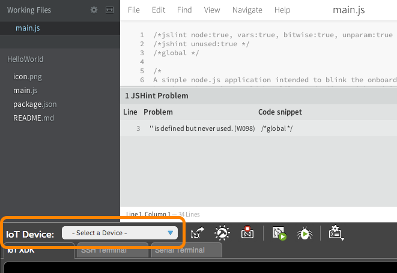

### Select a target IoT device

The Intel® XDK IoT Edition will automatically detect Intel® IoT devices on your network and display them in the "IoT Device" drop down list.

---

*Problems with Wi-Fi? Need to program while offline?*

The Intel® XDK requires the IP address of your IoT board in order to program it. If your IoT board is online, the IP address is automatically detected in most cases. 

However, if you are unable to get your IoT board online to the same network as your computer due to restricted or busy Wi-Fi networks, try a direct cable-based method and [Add a device manually](troubleshooting.md#add-a-device-manually) to the drop down list.

* **Intel® Galileo users:**

  Connect an ethernet cable directly from your computer to the Intel® Galileo.

* **Intel® Edison users:**

  Use the device mode micro-USB cable to establish an "Ethernet over USB" connection. Refer to [Ethernet over USB](/connectivity/ethernet_over_usb/) for further instruction.

---

1. In the bottom left corner of the Intel® XDK, click the "**IoT Device**" drop down list which currently indicates " - Select a Device - ".

  

2. Select your target Intel® Galileo or Intel® Edison from the list. If there are multiple devices, choose based on the device name and IP address. 

  

  ---

  **Do not see your device in the "IoT Device" drop down list?**

  * Check that your Intel® IoT board is online via Wi-Fi or ethernet, and that your development computer is on the same network as the IoT board.

  * If your internet network requires additional login credentials (e.g. a university Wi-Fi network), you may need to add the IP address manually. Refer to [Add a device manually](troubleshooting.md#add-a-device-manually) in the Troubleshooting appendix.

  * If you are using Ethernet over USB for the Intel® Edison, or a direct Ethernet connection for the Intel® Galileo, you may need to add the IP address manually. Refer to [Add a device manually](troubleshooting.md#add-a-device-manually) in the Troubleshooting appendix.

  * For more detailed troubleshooting steps, refer to [Don't see your device in the "IoT Device" drop down list?](troubleshooting.md#dont-see-your-device-in-the-iot-device-drop-down-list) in the Troubleshooting appendix.

  ---

  Wait a moment for the connection to be established. A popup window will appear to confirm the connection status. 

  ---
  