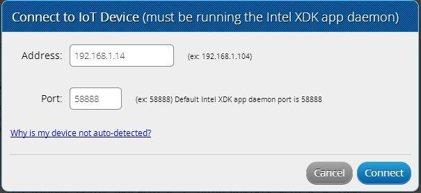

# Troubleshooting - Intel® XDK

Some common issues have been listed below. For additional troubleshooting and FAQ, visit [software.intel.com/en-us/articles/intel-xdk-iot-edition-troubleshooting-and-faq](https://software.intel.com/en-us/articles/intel-xdk-iot-edition-troubleshooting-and-faq). 

**Table of contents**

* [Don't see your device in the "IoT Device" drop down list?](#dont-see-your-device-in-the-iot-device-drop-down-list)
  * [Add a device manually](#add-a-device-manually)
  * [Restart the Intel XDK app daemon](#restart-the-intel-xdk-app-daemon)
* [Additional resources](#additional-resources)


## Don't see your device in the "IoT Device" drop down list?

### Add a device manually

You will need to add the IP address of your IoT device manually if you are using:

* Ethernet over USB for the Intel® Edison, 
* a direct ethernet connection for the Intel® Galileo, or
* an internet network that requires additional login credentials (e.g. a university Wi-Fi network)

1. From the "**IoT Device**" drop down list, select "**Add Manual Connection**".

  

2. For "**Address**", enter the IP address of your board.
  
  For "**Port**", leave as the default "58888".

  

  ---

  **Don't know the IP address?**

  Refer to:

  * [Connect Your Intel Edison to Wi-Fi → Identify the IP address](../connectivity/wifi/connect.md#identify-the-ip-address). 
  * Or use 192.168.2.15 if you're using [Ethernet over USB](../connectivity/ethernet_over_usb/).

  ---

3. Click "**Connect**" to try connecting to the IoT device using the manual settings.

### Restart the Intel XDK app daemon

The Intel® XDK app daemon may not be running on the Intel® IoT board.

1. Establish a serial connection to your Intel® Galileo or Intel® Edison.

  _Don't know how? Refer to [Shell Access](../shell_access/)._

2. Use the `systemctl` command to enable and restart the xdk-daemon on the IoT board.

	```
	systemctl enable xdk-daemon
	systemctl restart xdk-daemon
	```

3. Re-check the "IoT Device" drop down list for your device.


## Additional resources

For additional help using the Intel® XDK, explore the articles or videos listed below.

* Official [Intel XDK Documentation](https://software.intel.com/en-us/html5/xdkdocs)

* [Intel® IoT Edition Demo Video](https://software.intel.com/en-us/html5/iot-demo) (video)

* [Securely Accessing Your Internet of Things (IoT) Device](https://software.intel.com/en-us/html5/documentation/secure-communication-intel-xdk-iot-edition)

* [Removing Intel® XDK Local Data on Windows, Apple OS X, & Linux](https://software.intel.com/en-us/html5/blogs/remove-xdk-local-data)

---

Return to [Set Up Intel XDK for IoT »](setup.md)
