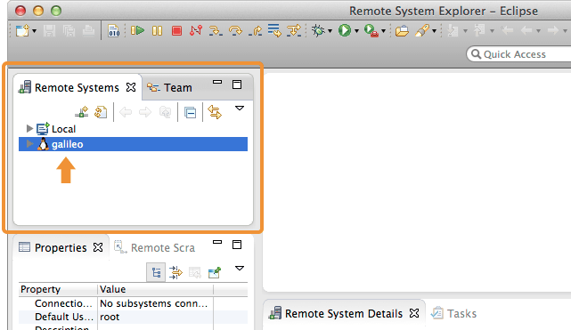

## Select a target IoT device

To connect to your IoT board, you will need to configure Eclipse with your Intel® Edison or Intel® Galileo's IP address.

---

1. Click the "**Remote System Explorer**" tab in the top right corner of the Eclipse screen.

  

2. From the "**Remote Systems**" panel on the left side, select "**galileo**".

  

  ---

  **But I have an Intel® Edison board?**

  The "galileo" entry is just a nomenclature and does not affect the environment even if you have an Intel® Edison and not an Intel® Galileo.

  ---

3. A "**Properties**" panel will update in the lower left of the Eclipse screen. Replace the entry for "**Host name**" with the IP address of your Intel® Edison or Intel® Galileo.

  

  ---

  **Don't know the IP address?**

  Refer to:

  * [Connect Your Intel Edison to Wi-Fi → Identify the IP address](/connectivity/wifi/details-identify_ip.md). 
  * Or use 192.168.2.15 if you're using [Ethernet over USB](/connectivity/ethernet_over_usb/).

  ---

---

**Problems with Wi-Fi? Need to program while offline?**

The dev kit Eclipse IDE requires the IP address of your IoT board in order to program it. If you are unable to get your IoT board online to the same network as your computer due to restricted or busy Wi-Fi networks, try a direct cable-based method.

**Intel® Galileo users:**

  Connect an Ethernet cable directly from your computer to the Intel® Galileo.

**Intel® Edison users:**

  Use the device mode micro-USB cable to establish an "Ethernet over USB" connection. Refer to [Ethernet over USB](/connectivity/ethernet_over_usb/) for further instruction.
