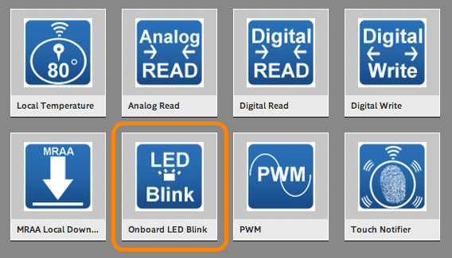
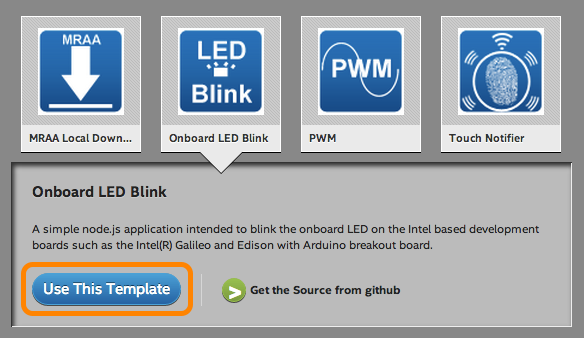
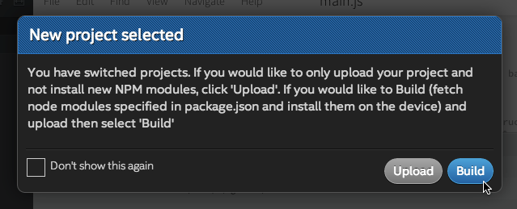

# Set Up Intel® XDK IoT Edition

The [Intel® XDK IoT Edition](https://software.intel.com/en-us/html5/xdk-iot) lets you create and test applications on Intel® IoT platforms. It uses NodeJS to communicate with all the GPIOs, libraries, and packages. The IoT edition also provides NodeJS templates for creating new applications that interact with sensors and actuators, enabling you to get a quick start on developing for the Internet of Things. 

This document will guide you through installing the Intel® XDK IoT Edition IDE, along with creating and running a Hello Word project (blinking the onboard LED) on either the Intel® Galileo or the Intel® Edison.

---

**Using a 64-bit Windows computer?**

Intel® XDK IoT Edition can be installed via the Windows 64-bit integrated installer. Refer to [Set Up Your Computer - Windows (64-bit integrated installer)](../set_up_your_computer-windows/64bit_integrated_installer.md) for more info.

---

**Table of contents**

* [Step 1: Install Intel® XDK IoT Edition](#step-1-install-intel-xdk-iot-edition)
* [Step 1b: Install Bonjour (Windows only)](#step-1b-install-bonjour-windows-only)
* [Step 2: Launch and sign into Intel® XDK](#step-2-launch-and-sign-into-intel-xdk)
* [Step 3: Run a sample application](#step-3-run-a-sample-application)
  * [Create a project](#create-a-project)
  * [Select a target IoT device](#select-a-target-iot-device)
  * [Sync device clocks](#sync-device-clocks)
  * [Build the application](#build-the-application)
  * [Upload and run the application](#upload-and-run-the-application)


**Related videos**

* [Setting Up The Intel XDK IoT Edition Part 1: Installation]()
* [Setting Up The Intel XDK IoT Edition Part 2: Run a Sample Project]()


## Step 1: Install Intel® XDK IoT Edition

Get the latest Intel® XDK IoT Edition installer for your computer's OS. Simply run the installer and follow the prompts. If more detail is needed, platform-specific instructions are below.

1. Get the latest Intel® XDK IoT Edition installer.

  **Online option:**

  1. Visit [software.intel.com/en-us/html5/xdk-iot](http://software.intel.com/en-us/html5/xdk-iot). 
  2. Ensure that your OS platform is selected in the green download box, then click "Go!" to start downloading the installer.

  **Hackathon attendees:**
  
  1. On the USB key: files → [your OS]
  2. Copy the appropriate iot_web file to your computer:
  
    * **Windows**: iot_web_win_master_[version].exe
    * **Mac**: iot_web_mac_master_[version].dmg
    * **Linux 32-bit**: iot_web_linux32_master_[version].tgz
    * **Linux 64-bit**: iot_web_linux64_master_[version].tgz

### On Windows

1. Double-click on **_iot_web_win_master_[version].exe_** to start the installer. 

### On Mac

1. Double-click on **_iot_web_mac_master_[version].dmg_** to open the Apple Disk Image.

2. Double-click on the extracted **_xdk_****__full_[version].pkg_** to start the installer.

### On Linux

1. Open Terminal.

2. Use the `cd` command to go into the folder where the installer file is. For example:

  ```
  cd ~/Desktop/
  ```

3. Use the `tar` command to extract** the **_.tgz_**. For example:

  ```
  tar zxvf iot_web_linux64_master_1912.tgz
  ```

  (Note: Replace the filename shown below with your .tgz filename.)

4. Go into the extracted folder, then run the installer shell file. For example:

  ```
  cd iot_web_linux64
  ./install.sh
  ```

### All platforms

After launching the Intel® XDK installer, follow the installation wizard and click "Next" where needed.


## Step 1b: Install Bonjour (Windows only)

Bonjour (or zeroconf) is a service that enables the Intel® XDK to auto detect Intel® IoT devices on your network. This service is already available on Mac and Linux; only Windows users need to install an additional Bonjour service.

1. Download Bonjour via *Bonjour Print Services for Windows*.

    1. Go to [http://support.apple.com/kb/DL999](http://support.apple.com/kb/DL999).

    2. Click "Download" to download [BonjourPSSetup.exe](http://support.apple.com/downloads/DL999/en_US/BonjourPSSetup.exe) to your computer.

2. Double-click on the downloaded *BonjourPSSetup.exe* to start the installer.

3. Follow the instructions in the installation wizard.

  


## Step 2: Launch and sign into Intel® XDK

Before you can use the Intel® XDK, you must sign up for an Intel® XDK account or log in to a pre-existing account.

---

Note: You will need to have an internet connection for the first time you launch the Intel XDK.

---

1. Launch Intel® XDK IoT Edition.

  

2. Follow the on-screen instructions to sign up for an Intel® XDK account, or log in to a pre-existing account.

  


## Step 3: Run a sample application

### Create a project

The Intel® XDK IoT Edition has various project creation options. To start, create a blinking LED project from a pre-existing sample.

1. Under the "**Internet of Things (IoT) with Node.js Projects**" option in the lefthand menu, select "**Start with a Sample or Template**".

  

2. A list of templates for developing Node.js applications will be shown. 

  Select "**Onboard LED Blink**" template.

  
  
3. Then click "**Use This Template"**.

  

4. Choose a directory for your project files, and enter a name for your project.

  

5. Click "**Create**" in the bottom right corner.

  

---

**Missing Bonjour?**

If Bonjour is not installed on your machine, you will see a "Bonjour is missing" message.

**Windows users:** Complete the steps in [Step 1b: Install Bonjour](#step-1b-install-bonjour-windows-only).

---


### Select a target IoT device

The Intel® XDK IoT Edition will automatically detect Intel® IoT devices on your network and display them in the "IoT Device" drop down list.

---

*Problems with Wi-Fi? Need to program while offline?*

The Intel® XDK requires the IP address of your IoT board in order to program it. If your IoT board is online, the IP address is automatically detected in most cases. 

However, if you are unable to get your IoT board online to the same network as your computer due to restricted or busy Wi-Fi networks, try a direct cable-based method and [Add a device manually](troubleshooting.md#add-a-device-manually) to the drop down list.

* **Intel® Galileo users:**

  Connect an ethernet cable directly from your computer to the Intel® Galileo.

* **Intel® Edison users:**

  Use the device mode micro-USB cable to establish an "Ethernet over USB" connection. Refer to [Ethernet over USB](../README#5-get-your-iot-board-online) for further instruction.

---

1. In the bottom left corner of the Intel® XDK, click the "**IoT Device**" drop down list which currently indicates " - Select a Device - ".

  

2. Select your target Intel® Galileo or Intel® Edison from the list. If there are multiple devices, choose based on the device name and IP address. 

  

  ---

  **Do not see your device in the "IoT Device" drop down list?**

  * Check that your Intel® IoT board is online via Wi-Fi or ethernet, and that your development computer is on the same network as the IoT board.

  * If your internet network requires additional login credentials (e.g. a university Wi-Fi network), you may need to add the IP address manually. Refer to [Add a device manually](troubleshooting.md#add-a-device-manually) in the Troubleshooting appendix.

  * If you are using Ethernet over USB for the Intel® Edison, or a direct ethernet connection for the Intel® Galileo, you may need to add the IP address manually. Refer to [Add a device manually](troubleshooting.md#add-a-device-manually) in the Troubleshooting appendix.

  * For more detailed troubleshooting steps, refer to [Don't see your device in the "IoT Device" drop down list?](troubleshooting.md#dont-see-your-device-in-the-iot-device-drop-down-list) in the Troubleshooting appendix.

  ---

  Wait a moment for the connection to be established. A popup window will appear to confirm the connection status. 


### Sync device clocks

Sync your computer's time with the clock on the target board to avoid timing issues. Do this step any time you connect to a new target IoT device or the device has been powered off.

1. In the bottom toolbar, click the "**Manage your daemon/IoT device**"** icon**.

  

2. Select "**sync PC time w/ clock on target device**".

  

---

A message in the console log will appear to confirm the update.

---

### Build the application

Fetch all the Node modules specified in package.json and install them on the IoT device. Run build any time you create a new project, or add/remove Node modules from an existing project.

1. In the bottom toolbar, click the "**Install/Build**" icon.

  

2. In the popup, click "**Build**".

  

---

Wait a moment for the packages to download and install. You will see a confirmation message in the console log.

Click the "Toggle console window" icon if you see any messages and the console is not already expanded.

---


### Upload and run the application

Upload the project files to the IoT device and run it. Remember that every time you make changes to files and you want to see the changes: (1) save the file, (2) upload, (3) run.

1. In the bottom toolbar, click the "**Upload**" icon to upload the current project to the device.

  

2. Check the console log for a message confirming the upload.

  

3. In the bottom toolbar, click the "**Run**" icon to run the project that is currently installed on the device.

  

4. Keep an eye on the console log bar for any runtime errors.

  

  Click the "Toggle console window" icon if you see any messages and the console is not already expanded.

---

**Get a "cannot find module mraa" message?**

If you see this error message, your board is missing libmraa, a library for GPIO communication on Linux platforms. 
Connect to your IoT board via serial or SSH. Then run the following commands: 

```
echo "src mraa-upm http://iotdk.intel.com/repos/1.1/intelgalactic" > /etc/opkg/mraa-upm.conf
opkg update
opkg install libmraa0
```

The first command will edit the mraa-upm config file on the board. The last two commands use the board's built-in Opkg package manager to download and update the missing library.

After updating the MRAA libraries, return to the Intel® XDK. Click the "Run" icon again to re-run the project on the device.

---

---

Look at your Intel® IoT board for a blinking light.

* **Intel® Galileo Gen 2**
  
  A green LED is located near the USB port.

* **Intel® Edison**
  
  The LED is located near the center of the board.

**Congratulations, you just ran your first Intel® XDK application!**

---

---

### Next Steps

Experiment with sample code supplied for available sensors and actuators.

* [Grove Starter Kit - JavaScript »](../sensor_examples-javascript/grove_starter_kit.md)


### Having troubles?

Refer to the [Troubleshooting - Intel XDK »](troubleshooting.md)