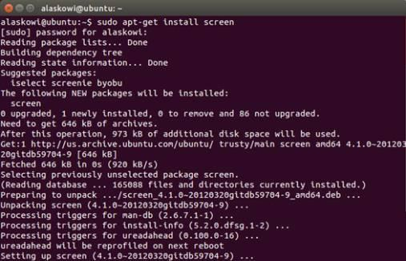

# Shell Access - Linux

Instructions for the **Intel® Galileo** and **Intel® Edison** on **Linux**

This setup document will guide you through establishing a serial connection to either the Intel® Galileo or the Intel® Edison using a Linux computer.

If you need to configure your IoT board, you will need to remotely connect to the Intel® Edison or Intel® Galileo. Once connected to your Intel® IoT board, you have access to the Linux-based Yocto operating system running on the board. 

You can then execute special Linux commands such:

* changing the hostname and password, 
* setting up Wi-Fi, or 
* flashing new firmware.

**Table of contents**

* [Install a shell session manager (Screen)](#install-a-shell-session-manager-Screen)
* [Establish a serial connection](#establish-a-serial-connection)


## Install a shell session manager (Screen)

Your computer may not have come with a pre-installed shell session manager. Download and install the GNU Screen utility.

1. Launch Terminal.

2. Install **screen** via the "apt-get install" command.

```
sudo apt-get install screen
```

You may be asked for your root password. Type in your root password and press Enter.

3. Wait for Screen to finish downloading and the installation to complete.

	

---

You should now have a shell session manager for your Terminal. 
To confirm that it has been installed, you can run the "screen" command with the "--help" flag to see what your options are.

```
sudo screen --help
```

---


## Establish a serial connection

Use the Screen utility that you installed in the previous section to gain command line access of your IoT board. For example: `sudo screen /dev/ttyUSB0 115200`

1. Open a new Terminal window.

2. Connect to the USB serial device using Screen.

	```
	sudo screen /dev/ttyUSB0 115200
	```

	"115200" indicates the baud rate. Always use 115200.

	You may be asked for your root password. Type in your root password and press Enter.

3. When you see a blank screen, **press the Enter key. 
For Intel****®**** Edison**: **press the Enter key again** (so two times in total).

4. Once connected you will see a login prompt. 

	Type in "**root**" for the username and press **Enter**.

	

---

You are now logged into your IoT board and can run shell commands. For example, in order to output the version number of the firmware running on your board:

```
cat /etc/version
```

The firmware version is in YYYYMMDDHHMM format so, in this case, Sept 3, 2014.

---

### Additional resources

For more info on using Screen such as quitting, read [Using Screen »](using_screen.md)


### Next Steps

Some Edison boards have older firmware images on them. You **_may_** need to update the firmware to a newer version to get access to important features.

[Flash Edison Firmware Manually »](../flash_firmware/manual.md)


