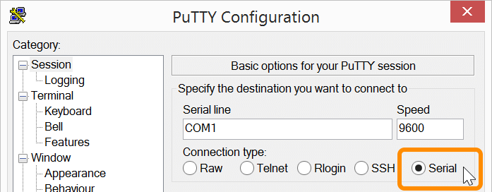
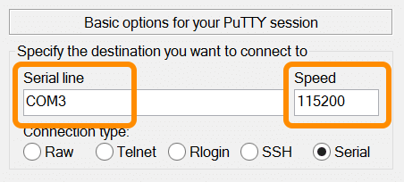
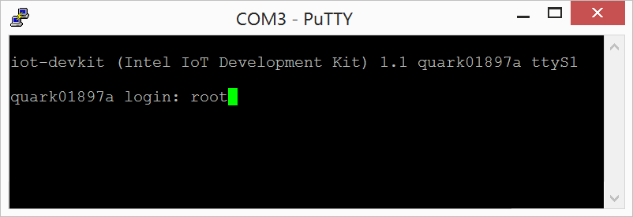

# Establish a serial connection

Use PuTTY to establish a **serial** connection to the IoT board using the COM # you noted in the previous [Identify the serial COM port](details-identify_com_port.md) section and the baud rate **115200**.

---

1. In PuTTY, double-check that you are in the "Session" screen. 

  

2. Select the "**Serial**" radio button under "Connection type".

  

3. Specify the destination you want to connect to:

  * **Serial Line**: use the **COM #** (e.g. "COM3") noted in [Identify the serial COM port](details-identify_com_port.md)
  * **Speed**: use "115200" for the baud rate
  
  

4. Click "**Open**" to connect to the board.

  

5. When you see a blank screen, **press the Enter key**.
 
  **For Intel® Edison boards running older firmare**: You may need to press the Enter key **twice**.

  

6. Once connected you will see a login prompt. 

  Type in "**root**" for the username and press **Enter**.

  
