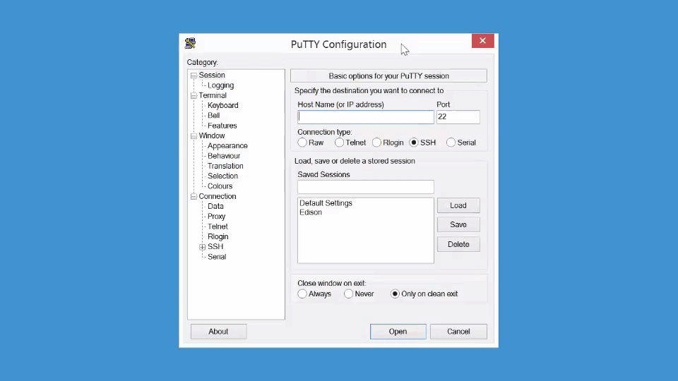

# Shell Access - Windows


If you need to configure your IoT board, you will need to remotely connect to the Intel® Edison or Intel® Galileo. Once connected to your Intel® IoT board, you have access to the Linux-based Yocto operating system running on the board. 

You can then execute special Linux commands such: changing the hostname and password, setting up Wi-Fi, or flashing new firmware.


**Table of contents**

* [Download a terminal client (PuTTY) »](#download-a-terminal-client-putty)
* [Identify the serial COM port »](#identify-the-serial-com-port)
* [Establish a serial connection »](#establish-a-serial-connection)


**Related videos**

[Shell Access – Windows](https://software.intel.com/en-us/videos/shell-access-windows)


## Download a terminal client (PuTTY)

Windows does not come with a built-in terminal emulator so download and use the [PuTTY](http://www.putty.org/) client.


[View detailed instructions »](details-putty.md)


## Identify the serial COM port

Use Device Manager to find the COM port number for the "**USB Serial Port**" connection. You will need the COM # to configure PuTTY in Establish a serial connection.


[View detailed instructions »](details-identify_com_port.md)


## Establish a serial connection

Use PuTTY to establish a **serial** connection to the IoT board using the COM # you noted in the previous [Identify the serial COM port](#identify-the-serial-com-port) section and the baud rate **115200**.



[View detailed instructions »](details-putty_serial_connection.md)


---

You are now logged into your IoT board and can run shell commands. For example, to output the version number of the firmware running on your board:

```
cat /etc/version
```


The firmware version is in YYYYMMDDHHMM format so, in this case, Sept 3, 2014.

---

### Additional resources

For more info on using PuTTY such as saving profiles, read [Using PuTTY »](using_putty.md)


### Next Steps

Some Edison boards have older firmware images on them. You _may_ need to update the firmware to a newer version to get access to important features.

[Flash Edison Firmware Manually »](../flash_firmware/manual.md)
