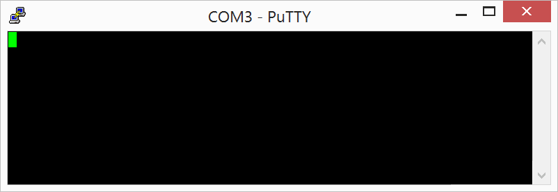

# Shell Access - Windows

**This setup document will guide you through establishing a serial connection to either the Intel® Galileo or the Intel® Edison using a Windows computer.**

If you need to configure your IoT board, you will need to remotely connect to the Intel® Edison or Intel® Galileo. Once connected to your Intel® IoT board, you have access to the Linux-based Yocto operating system running on the board. 

You can then execute special Linux commands such:

* changing the hostname and password, 
* setting up Wi-Fi, or 
* flashing new firmware.


**Table of contents**

* [Download a terminal client (PuTTY)](#download-a-terminal-client-putty)
* [Identify the COM port](#identify-the-com-port)
* [Establish a serial connection](#establish-a-serial-connection)


**Related videos**

[Shell Access – Windows]()


## Download a terminal client (PuTTY)

Windows does not come with a built-in terminal emulator so download and use the PuTTY client.

1. Visit the PuTTY download page: [http://www.chiark.greenend.org.uk/~sgtatham/putty/download.html](http://www.chiark.greenend.org.uk/~sgtatham/putty/download.html).

2. Under the "**For Windows on Intel x86**" heading, click on the "[putty.exe](http://the.earth.li/~sgtatham/putty/latest/x86/putty.exe)" link to download the latest release version to your computer. 

	

3. Double-click putty.exe on your computer to launch PuTTY.

	


## Identify the COM port

Use Device Manager to find the COM port number for the "USB Serial Port" connection. You will need the COM # to configure PuTTY in Establish a serial connection.

1. Open Device Manager and scroll down to the "**Ports (COM & LPT)**" section.

	_Don't know how? Refer to [Confirm Drivers → Open Device Manager](../set_up_your_computer-windows/confirm_drivers.md#open-windows-device-manager)._

2. **Make a note of your COM #** for the "**USB Serial Port**" device. 

	

	---

	**Do you have the right COM number?**
	
	Use the COM # shown on your computer's Device Manager. In the screenshot, it is "COM3" but your computer will have unique COM port number assignments and may be different from the screenshot.
	
	Do **not** use the COM number for "Intel Edison USB Composite Device" or "Intel Edison Virtual Com Port".

	---

---

**Don't see a "USB Serial Port" device listed?**

* **Do you have the serial drivers installed?**
	* A serial connection cannot be detected without FTDI serial drivers. Refer to [Set Up Your Computer - Windows (64-bit integrated installer)](../set_up_your_computer-windows/64bit_integrated_installer.md) or Set Up Your Computer - Windows (manual).

* **Do you have the UART/serial cable connected?** Refer to [Connecting Cables → UART/serial micro-USB cable](../assembly-arduino_expansion_board/connecting_cables.md#uartserial-micro-usb-cable).

* Is your IoT board powered on?

---


# Establish a serial connection

Use PuTTY to establish a serial connection to the IoT board using the COM # you noted in the previous Identify the COM port section.

1. In PuTTY, double-check that you are in the "Session" screen. 

	

2. Select the "**Serial**" radio button under "Connection type".

	

3. Specify the destination you want to connect to:

    1. **Serial Line**: use the **COM #** (e.g. "COM3") noted in [Identify the COM port](#identify-the-com-port)

    2. **Speed**: use "115200" for the baud rate

	

4. Click "**Open**" to connect to the board.

	

1. When you see a blank screen, **press the Enter key**.
 
	**For Intel® Edison boards running older firmare**: You may need to press the Enter key **twice**.

	

2. Once connected you will see a login prompt. 
Type in "**root**" for the username and press **Enter**.

	

---

You are now logged into your IoT board and can run shell commands. 
For example, in order to output the version number of the firmware running on your board:

```
cat /etc/version
```

The firmware version is in YYYYMMDDHHMM format so, in this case, Sept 3, 2014.

---

### Additional resources

For more info on using PuTTY such as saving profiles, read [Using PuTTY »](using_putty.md)


### Next Steps

Some Edison boards have older firmware images on them. You **_may_** need to update the firmware to a newer version to get access to important features.

[Flash Edison Firmware Manually »](../flash_firmware/manual.md)


